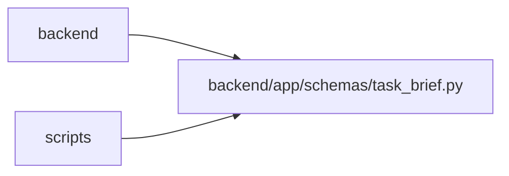

# task_brief Module

**Path:** `backend/app/schemas/task_brief.py`

## Description

Canonical brief inputs and separate execution evidence/review contracts.

## Imports

| Source | Symbols |
|--------|---------|
| `datetime` | `datetime` |
| `pydantic` | `BaseModel`, `ConfigDict`, `Field`, `field_validator`, `model_validator` |
| `typing` | `Literal` |
| `uuid` | `uuid4` |

## Local dependency map

<!-- Auto-generated local dependency summary. Do not edit by hand. -->

> Module-level dependencies exceed the generated-diagram limits, so the diagram and table below group them by top-level package. Counts report the number of module neighbors in each package.

### Internal neighbors

| Direction | Module |
|---|---|
| Inbound | `backend` (11) |
| Inbound | `scripts` (1) |

### External packages

| Language | Used packages | Undeclared packages |
|---|---:|---:|
| python | 1 | 0 |

> All 12 module neighbor(s) are summarized by package because the module-level view exceeds the 12-node limit.

## Classes

| Class | Line | Bases | Description |
|-------|------|-------|-------------|
| [BriefCriterion](../entities/schemas_task_brief_BriefCriterion.md) | 10 | `BaseModel` | — |
| [TaskBrief](../entities/schemas_task_brief_TaskBrief.md) | 25 | `BaseModel` | — |
| [BriefWrite](../entities/BriefWrite.md) | 44 | `BaseModel` | — |
| [BriefConvert](../entities/BriefConvert.md) | 50 | `BaseModel` | — |
| [CriterionProgress](../entities/schemas_task_brief_CriterionProgress.md) | 56 | `BaseModel` | — |
| [ProgressWrite](../entities/ProgressWrite.md) | 64 | `BaseModel` | — |
| [TaskReviewWrite](../entities/TaskReviewWrite.md) | 80 | `BaseModel` | — |
| [TaskReviewResponse](../entities/TaskReviewResponse.md) | 90 | `BaseModel` | — |
| [CurrentTaskReviewResponse](../entities/CurrentTaskReviewResponse.md) | 103 | `BaseModel` | — |
