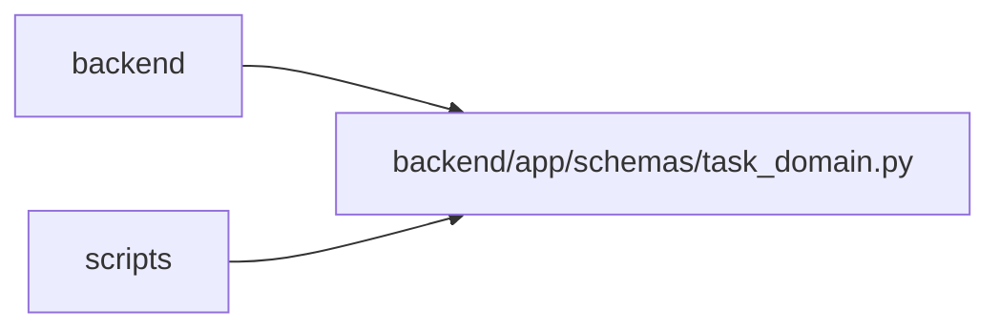

# task_domain Module

**Path:** `backend/app/schemas/task_domain.py`

## Description

Explicit task commands and typed action availability.

## Imports

| Source | Symbols |
|--------|---------|
| `pydantic` | `BaseModel`, `ConfigDict`, `Field`, `model_validator` |
| `typing` | `Literal` |

## Local dependency map

<!-- Auto-generated local dependency summary. Do not edit by hand. -->

> Module-level dependencies exceed the generated-diagram limits, so the diagram and table below group them by top-level package. Counts report the number of module neighbors in each package.

### Internal neighbors

| Direction | Module |
|---|---|
| Inbound | `backend` (11) |
| Inbound | `scripts` (1) |

### External packages

| Language | Used packages | Undeclared packages |
|---|---:|---:|
| python | 1 | 0 |

> All 12 module neighbor(s) are summarized by package because the module-level view exceeds the 12-node limit.

## Classes

| Class | Kind | Line | Bases / Target | Description |
|-------|------|------|----------------|-------------|
| [TaskAction](../entities/TaskAction.md) | Type alias | 7 | `Literal['start_manual', 'resolve_manual', 'block', 'unblock', 'cancel', 'reopen', 'commit', 'uncommit']` | — |
| [TaskActionRequest](../entities/TaskActionRequest.md) | Pydantic model | 10 | `BaseModel` | — |
| [TaskActionBlocker](../entities/TaskActionBlocker.md) | Pydantic model | 30 | `BaseModel` | — |
| [TaskActionAvailability](../entities/schemas_task_domain_TaskActionAvailability.md) | Pydantic model | 35 | `BaseModel` | — |
| [TaskActionsResponse](../entities/TaskActionsResponse.md) | Pydantic model | 41 | `BaseModel` | — |
| [BacklogRestoreRequest](../entities/BacklogRestoreRequest.md) | Pydantic model | 50 | `BaseModel` | — |
