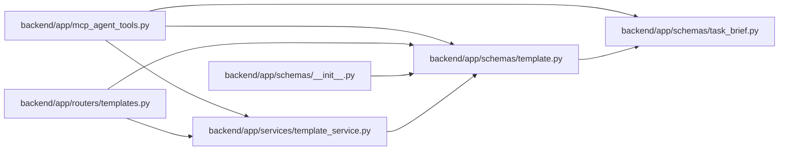

# template Module

**Path:** `backend/app/schemas/template.py`

## Description

Reusable work template schemas.

## Imports

| Source | Symbols |
|--------|---------|
| `app.schemas.task_brief` | `TaskBrief` |
| `datetime` | `datetime` |
| `enum` | `Enum` |
| `pydantic` | `BaseModel`, `ConfigDict`, `Field`, `field_validator` |
| `typing` | `Any`, `Optional` |

## Local dependency map

<!-- Auto-generated local dependency summary. Do not edit by hand. -->

### Internal neighbors

| Direction | Module |
|---|---|
| Inbound | [mcp_agent_tools](../modules/mcp_agent_tools.md) |
| Inbound | [templates](../modules/templates.md) |
| Inbound | [schemas___init__](../modules/schemas___init__.md) |
| Inbound | [template_service](../modules/template_service.md) |
| Outbound | [schemas_task_brief](../modules/schemas_task_brief.md) |

### External packages

| Language | Used packages | Undeclared packages |
|---|---:|---:|
| python | 1 | 0 |

## Classes

| Class | Kind | Line | Bases / Target | Description |
|-------|------|------|----------------|-------------|
| [TemplateType](../entities/schemas_template_TemplateType.md) | Enum | 16 | `str`, `Enum` | Template target type. |
| [WorkTemplateCreate](../entities/schemas_template_WorkTemplateCreate.md) | Pydantic model | 23 | `BaseModel` | Schema for creating a reusable work template. |
| [WorkTemplateUpdate](../entities/schemas_template_WorkTemplateUpdate.md) | Pydantic model | 47 | `BaseModel` | Schema for updating a reusable work template. |
| [WorkTemplateResponse](../entities/WorkTemplateResponse.md) | Pydantic model | 71 | `BaseModel` | Schema for reusable work template responses. |

## Functions

| Function | Signature | Decorators | Description |
|----------|-----------|------------|-------------|
| `_canonical_template_payload` | `(payload)` | — | — |
