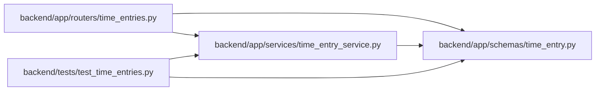

# time_entry Module

**Path:** `backend/app/schemas/time_entry.py`

## Description

Bounded minute/date contracts with explicit correction versions.

## Imports

| Source | Symbols |
|--------|---------|
| `datetime` | `date`, `datetime` |
| `pydantic` | `BaseModel`, `ConfigDict`, `Field`, `StrictInt`, `field_validator` |
| `re` | `re` |
| `typing` | `Literal` |
| `uuid` | `UUID` |
| `zoneinfo` | `ZoneInfo`, `ZoneInfoNotFoundError` |

## Local dependency map

<!-- Auto-generated local dependency summary. Do not edit by hand. -->

### Internal neighbors

| Direction | Module |
|---|---|
| Inbound | [time_entries](../modules/time_entries.md) |
| Inbound | [time_entry_service](../modules/time_entry_service.md) |
| Inbound | [test_time_entries](../modules/test_time_entries.md) |

### External packages

| Language | Used packages | Undeclared packages |
|---|---:|---:|
| python | 1 | 0 |

## Classes

| Class | Line | Bases | Description |
|-------|------|-------|-------------|
| [TimeValues](../entities/TimeValues.md) | 12 | `BaseModel` | — |
| [TimeEntryCreate](../entities/TimeEntryCreate.md) | 38 | `TimeValues` | — |
| [CorrectionReason](../entities/CorrectionReason.md) | 44 | `BaseModel` | — |
| [TimeEntryCorrection](../entities/TimeEntryCorrection.md) | 56 | `TimeValues`, `CorrectionReason` | — |
| [TimeEntryVoid](../entities/TimeEntryVoid.md) | 60 | `CorrectionReason` | — |
| [TimeEntryResponse](../entities/TimeEntryResponse.md) | 64 | `TimeValues` | — |
| [TimeEntryPage](../entities/TimeEntryPage.md) | 76 | `BaseModel` | — |
| [TimeRevisionResponse](../entities/TimeRevisionResponse.md) | 84 | `TimeValues` | — |
| [TimeRevisionPage](../entities/TimeRevisionPage.md) | 92 | `BaseModel` | — |
| [TimeEntryCapabilities](../entities/TimeEntryCapabilities.md) | 98 | `BaseModel` | — |
