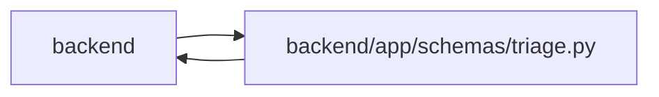

# triage Module

**Path:** `backend/app/schemas/triage.py`

## Description

Triage item schemas.

## Imports

| Source | Symbols |
|--------|---------|
| `app.schemas.task` | `TaskResponse` |
| `datetime` | `datetime` |
| `enum` | `Enum` |
| `pydantic` | `BaseModel`, `ConfigDict`, `Field`, `model_validator` |
| `typing` | `Any`, `Literal`, `Optional` |

## Local dependency map

<!-- Auto-generated local dependency summary. Do not edit by hand. -->

> Module-level dependencies exceed the generated-diagram limits, so the diagram and table below group them by top-level package. Counts report the number of module neighbors in each package.

### Internal neighbors

| Direction | Module |
|---|---|
| Inbound | `backend` (12) |
| Outbound | `backend` (1) |

### External packages

| Language | Used packages | Undeclared packages |
|---|---:|---:|
| python | 1 | 0 |

> All 13 module neighbor(s) are summarized by package because the module-level view exceeds the 12-node limit.

## Classes

| Class | Kind | Line | Bases / Target | Description |
|-------|------|------|----------------|-------------|
| [TriageItemStatus](../entities/schemas_triage_TriageItemStatus.md) | Enum | 11 | `str`, `Enum` | Triage item lifecycle status. |
| [TriageItemCreate](../entities/schemas_triage_TriageItemCreate.md) | Pydantic model | 21 | `BaseModel` | Schema for creating a triage item. |
| [TriageItemUpdate](../entities/schemas_triage_TriageItemUpdate.md) | Pydantic model | 50 | `BaseModel` | Schema for updating a triage item. |
| [TriageItemResponse](../entities/TriageItemResponse.md) | Pydantic model | 79 | `BaseModel` | Schema for triage item response. |
| [TriageActionRequest](../entities/schemas_triage_TriageActionRequest.md) | Pydantic model | 106 | `BaseModel` | Request for simple triage status actions. |
| [TriageSnoozeRequest](../entities/schemas_triage_TriageSnoozeRequest.md) | Pydantic model | 111 | `BaseModel` | Request for snoozing a triage item. |
| [TriageDuplicateRequest](../entities/schemas_triage_TriageDuplicateRequest.md) | Pydantic model | 117 | `BaseModel` | Request for marking a triage item as duplicate. |
| [TriageDuplicateSuggestion](../entities/schemas_triage_TriageDuplicateSuggestion.md) | Pydantic model | 134 | `BaseModel` | Candidate duplicate returned by advisory duplicate search. |
| [TriageDuplicateSuggestionsResponse](../entities/schemas_triage_TriageDuplicateSuggestionsResponse.md) | Pydantic model | 151 | `BaseModel` | Response for advisory duplicate suggestions. |
| [TriageClassificationDraft](../entities/TriageClassificationDraft.md) | Pydantic model | 158 | `BaseModel` | Internal normalized triage classification draft before persistence. |
| [TriageClassificationSuggestionResponse](../entities/TriageClassificationSuggestionResponse.md) | Pydantic model | 178 | `BaseModel` | Stored advisory classification suggestion for a triage item. |
| [TriageTaskDraftRequest](../entities/schemas_triage_TriageTaskDraftRequest.md) | Pydantic model | 203 | `BaseModel` | Request for transient AI-assisted triage task drafting. |
| [TriageTaskDraftResponse](../entities/schemas_triage_TriageTaskDraftResponse.md) | Pydantic model | 213 | `BaseModel` | Transient suggested task details for triage conversion. |
| [TriageConvertToTaskRequest](../entities/schemas_triage_TriageConvertToTaskRequest.md) | Pydantic model | 237 | `BaseModel` | Request for converting a triage item to a task. |
| [TriageConvertToTaskResponse](../entities/schemas_triage_TriageConvertToTaskResponse.md) | Pydantic model | 260 | `BaseModel` | Response for triage item conversion. |
