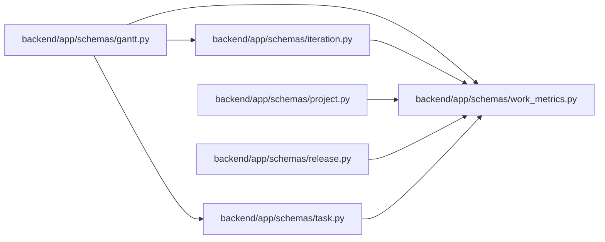

# work_metrics Module

**Path:** `backend/app/schemas/work_metrics.py`

## Description

Shared additive delivery metrics; legacy completed fields mean implemented work.

## Imports

| Source | Symbols |
|--------|---------|
| `pydantic` | `BaseModel` |

## Local dependency map

<!-- Auto-generated local dependency summary. Do not edit by hand. -->

### Internal neighbors

| Direction | Module |
|---|---|
| Inbound | [schemas_gantt](../modules/schemas_gantt.md) |
| Inbound | [schemas_iteration](../modules/schemas_iteration.md) |
| Inbound | [schemas_project](../modules/schemas_project.md) |
| Inbound | [schemas_release](../modules/schemas_release.md) |
| Inbound | [schemas_task](../modules/schemas_task.md) |

### External packages

| Language | Used packages | Undeclared packages |
|---|---:|---:|
| python | 1 | 0 |

## Classes

| Class | Line | Bases | Description |
|-------|------|-------|-------------|
| [WorkMetricSummary](../entities/WorkMetricSummary.md) | 6 | `BaseModel` | — |
| [TaskMetricSignals](../entities/TaskMetricSignals.md) | 24 | `BaseModel` | — |
