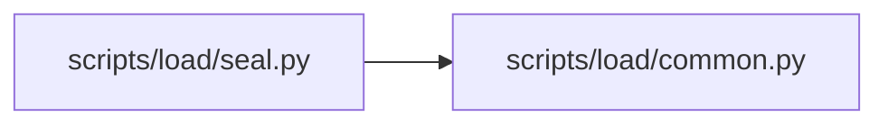

# seal Module

**Path:** `scripts/load/seal.py`

## Description

Seal a reviewed JSON evidence object with its canonical SHA-256.

## Imports

| Source | Symbols |
|--------|---------|
| `__future__` | `annotations` |
| `argparse` | `argparse` |
| `pathlib` | `Path` |
| `scripts.load.common` | `DOCUMENT_CHECKSUM_FIELD`, `QualificationInputError`, `atomic_write_json`, `read_json_object` |
| `sys` | `sys` |

## Local dependency map

<!-- Auto-generated local dependency summary. Do not edit by hand. -->

### Internal neighbors

| Direction | Module |
|---|---|
| Outbound | [load_common](../modules/load_common.md) |

## Functions

| Function | Signature | Decorators | Description |
|----------|-----------|------------|-------------|
| `_parser` | `() -> argparse.ArgumentParser` | — | — |
| `main` | `() -> int` | — | — |
