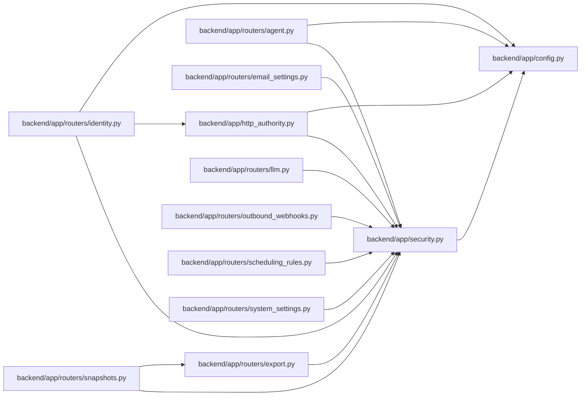

# security Module

**Path:** `backend/app/security.py`

## Description

Shared request authorization helpers.

## Imports

| Source | Symbols |
|--------|---------|
| `app.config` | `get_settings` |
| `fastapi` | `Header`, `HTTPException`, `status`, `Request` |
| `secrets` | `secrets` |
| `typing` | `Annotated`, `Optional` |

## Local dependency map

<!-- Auto-generated local dependency summary. Do not edit by hand. -->

### Internal neighbors

| Direction | Module |
|---|---|
| Inbound | [http_authority](../modules/http_authority.md) |
| Inbound | [routers_agent](../modules/routers_agent.md) |
| Inbound | [routers_email_settings](../modules/routers_email_settings.md) |
| Inbound | [export](../modules/export.md) |
| Inbound | [routers_identity](../modules/routers_identity.md) |
| Inbound | [routers_llm](../modules/routers_llm.md) |
| Inbound | [outbound_webhooks](../modules/outbound_webhooks.md) |
| Inbound | [routers_scheduling_rules](../modules/routers_scheduling_rules.md) |
| Inbound | [snapshots](../modules/snapshots.md) |
| Inbound | [routers_system_settings](../modules/routers_system_settings.md) |
| Outbound | [config](../modules/config.md) |

### External packages

| Language | Used packages | Undeclared packages |
|---|---:|---:|
| python | 1 | 0 |

## Functions

| Function | Signature | Decorators | Description |
|----------|-----------|------------|-------------|
| `admin_api_key_is_valid` | `(api_key: Optional[str]) -> bool` | — | Return whether a provided admin API key matches configured settings. |
| `require_admin_api_key` | *(async)* `(api_key: Annotated[Optional[str], Header(alias=ADMIN_API_KEY_HEADER)] = None, request: Request = None) -> None` | — | Require the configured admin API key for control-plane API routes. |
