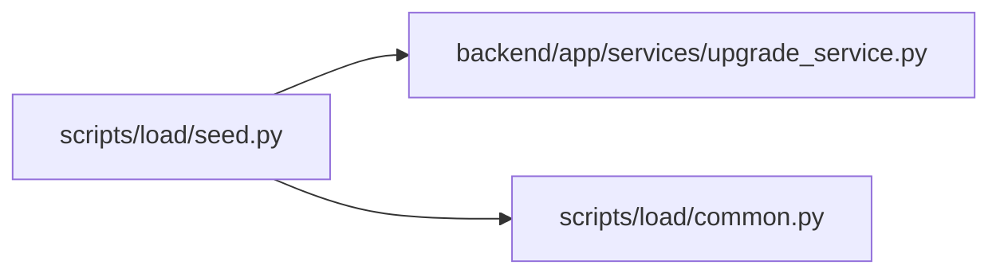

# seed Module

**Path:** `scripts/load/seed.py`

## Description

Create the deterministic, resumable PostgreSQL qualification data set.

## Imports

| Source | Symbols |
|--------|---------|
| `__future__` | `annotations` |
| `app.services.upgrade_service` | `head_revision` |
| `argparse` | `argparse` |
| `base64` | `base64` |
| `datetime` | `UTC`, `datetime`, `timedelta` |
| `hashlib` | `hashlib` |
| `math` | `math` |
| `os` | `os` |
| `pathlib` | `Path` |
| `scripts.load.common` | `CAPACITY_CONTRACT_REFERENCE`, `QualificationInputError`, `atomic_write_json`, `capacity_contract`, `contract_sha256`, `read_json_object`, `sha256_file`, `utc_now_text` |
| `sqlalchemy` | `create_engine`, `inspect`, `text` |
| `sqlalchemy.engine` | `Connection`, `Engine`, `make_url` |
| `sys` | `sys` |
| `typing` | `Any`, `Callable`, `Mapping` |

## Local dependency map

<!-- Auto-generated local dependency summary. Do not edit by hand. -->

### Internal neighbors

| Direction | Module |
|---|---|
| Outbound | [upgrade_service](../modules/upgrade_service.md) |
| Outbound | [load_common](../modules/load_common.md) |

### External packages

| Language | Used packages | Undeclared packages |
|---|---:|---:|
| python | 2 | 2 |

## Functions

| Function | Signature | Decorators | Description |
|----------|-----------|------------|-------------|
| `_token` | `(seed: int, kind: str, index: int, *, prefix: str = '') -> str` | — | — |
| `_token_hash` | `(value: str) -> str` | — | — |
| `_profile_cardinalities` | `(profile: str) -> dict[str, int]` | — | — |
| `_derived_cardinalities` | `(cardinalities: Mapping[str, int]) -> dict[str, int]` | — | — |
| `_target_identifier` | `(database_url: str) -> str` | — | — |
| `_validate_target` | `(database_url: str, authorized_target: str) -> str` | — | — |
| `_empty_checkpoint` | `(*, profile: str, seed: int, target: str, as_of: str) -> dict[str, Any]` | — | — |
| `_load_checkpoint` | `(path: Path, *, profile: str, seed: int, target: str, as_of: str) -> dict[str, Any]` | — | — |
| `_save_checkpoint` | `(path: Path, checkpoint: dict[str, Any]) -> None` | — | — |
| `_count` | `(connection: Connection, table: str) -> int` | — | — |
| `_require_initial_target` | `(connection: Connection, checkpoint: Mapping[str, Any]) -> None` | — | — |
| `_record_stage` | `(checkpoint_path: Path, checkpoint: dict[str, Any], stage: str, completed: int) -> None` | — | — |
| `_single_stage` | `(engine: Engine, checkpoint_path: Path, checkpoint: dict[str, Any], *, stage: str, expected: int, action: Callable[[Connection], None]) -> None` | — | — |
| `_chunk_stage` | `(engine: Engine, checkpoint_path: Path, checkpoint: dict[str, Any], *, stage: str, expected: int, chunk_size: int, action: Callable[[Connection, int, int], None]) -> None` | — | — |
| `_insert_calendar` | `(connection: Connection) -> None` | — | — |
| `_insert_projects` | `(connection: Connection, count: int) -> None` | — | — |
| `_insert_iterations` | `(connection: Connection, count: int, projects: int) -> None` | — | — |
| `_insert_team_members` | `(connection: Connection, count: int) -> None` | — | — |
| `_insert_vacations` | `(connection: Connection, count: int, members: int) -> None` | — | — |
| `_insert_tasks` | `(connection: Connection, start: int, end: int, *, projects: int, iterations: int, hot_iteration_tasks: int, hot_project_tasks: int) -> None` | — | — |
| `_dependency_edges` | `(task_count: int, edge_count: int) -> list[dict[str, int]]` | — | — |
| `_insert_dependencies` | `(connection: Connection, hot_tasks: int, edge_count: int) -> None` | — | — |
| `_session_rows` | `(seed: int, count: int, *, as_of: str = FIXED_TIME) -> tuple[list[dict[str, Any]], list[dict[str, Any]]]` | — | — |
| `_insert_sessions` | `(connection: Connection, rows: list[dict[str, Any]]) -> None` | — | — |
| `_insert_status_logs` | `(connection: Connection, start: int, end: int, tasks: int) -> None` | — | — |
| `_actor_rows` | `(seed: int, count: int) -> tuple[list[dict[str, Any]], list[dict[str, Any]]]` | — | — |
| `_insert_actors` | `(connection: Connection, rows: list[dict[str, Any]]) -> None` | — | — |
| `_insert_agent_runs` | `(connection: Connection, start: int, end: int, *, tasks: int, actors: int) -> None` | — | — |
| `_insert_agent_events` | `(connection: Connection, start: int, end: int, runs: int) -> None` | — | — |
| `_insert_outbound_events` | `(connection: Connection, start: int, end: int, tasks: int) -> None` | — | — |
| `_insert_deliveries` | `(connection: Connection, start: int, end: int) -> None` | — | — |
| `_insert_assignments` | `(connection: Connection, count: int, *, tasks: int, actors: int) -> None` | — | — |
| `_repair_sequences` | `(connection: Connection) -> None` | — | — |
| `_database_facts` | `(connection: Connection) -> dict[str, Any]` | — | — |
| `_write_credentials` | `(path: Path, *, seed: int, browsers: list[dict[str, Any]], agents: list[dict[str, Any]], cardinalities: Mapping[str, int], agent_assignments: int) -> None` | — | — |
| `seed_database` | `(args: argparse.Namespace) -> dict[str, Any]` | — | — |
| `_dry_manifest` | `(args: argparse.Namespace) -> dict[str, Any]` | — | — |
| `_parser` | `() -> argparse.ArgumentParser` | — | — |
| `main` | `() -> int` | — | — |
