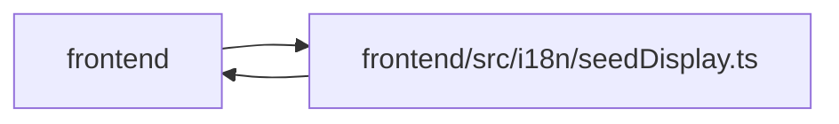

# seedDisplay Module

**Path:** `frontend/src/i18n/seedDisplay.ts`

## Description

_Auto-generated from `frontend/src/i18n/seedDisplay.ts`._

## Imports

| Source | Symbols |
|--------|---------|
| `../types/github` | `GitHubStatusAutomationRule` |
| `../types/label` | `Label`, `LabelGroup` |
| `../types/savedView` | `SavedView`, `SavedViewDashboardCard` |
| `../types/template` | `WorkTemplate` |
| `./i18n` | `i18n` |

## Module Signals

| Signal | Values |
|--------|--------|
| Exports | `githubRuleDisplay`, `labelDisplay`, `labelGroupDisplay`, `savedViewDisplay`, `templateDisplay` |
| Constants | `templateBaselines`, `labelGroupBaselines`, `labelBaselines`, `savedViewBaselines`, `githubRuleBaselines` |

## Local dependency map

<!-- Auto-generated local dependency summary. Do not edit by hand. -->

> Module-level dependencies exceed the generated-diagram limits, so the diagram and table below group them by top-level package. Counts report the number of module neighbors in each package.

### Internal neighbors

| Direction | Module |
|---|---|
| Inbound | `frontend` (11) |
| Outbound | `frontend` (5) |

> All 16 module neighbor(s) are summarized by package because the module-level view exceeds the 12-node limit.

## Classes

| Class | Kind | Line | Bases / Target | Description |
|-------|------|------|----------------|-------------|
| [TemplateSeedBaseline](../entities/TemplateSeedBaseline.md) | Class | 7 | — | — |

## Functions

| Function | Signature | Decorators | Description |
|----------|-----------|------------|-------------|
| `labelGroupDisplay` | `(group: LabelGroup \| { seed_key?: string \| null; name: string; description?: string \| null })` | — | — |
| `labelDisplay` | `(label: Label \| { seed_key?: string \| null; name: string; description?: string \| null })` | — | — |
| `templateDisplay` | `(template: WorkTemplate)` | — | — |
| `savedViewDisplay` | `(view: SavedView \| SavedViewDashboardCard)` | — | — |
| `githubRuleDisplay` | `(rule: GitHubStatusAutomationRule)` | — | — |
