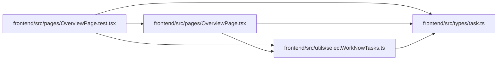

# selectWorkNowTasks Module

**Path:** `frontend/src/utils/selectWorkNowTasks.ts`

## Description

_Auto-generated from `frontend/src/utils/selectWorkNowTasks.ts`._

## Imports

| Source | Symbols |
|--------|---------|
| `../types/task` | `Task` |

## Module Signals

| Signal | Values |
|--------|--------|
| Exports | `selectWorkNowTasks` |
| Constants | `doneStatuses` |
| Module calls | `doneStatuses = Set` |

## Local dependency map

<!-- Auto-generated local dependency summary. Do not edit by hand. -->

### Internal neighbors

| Direction | Module |
|---|---|
| Inbound | [OverviewPage.test](../modules/OverviewPage.test.md) |
| Inbound | [OverviewPage](../modules/OverviewPage.md) |
| Outbound | [types_task](../modules/types_task.md) |

## Functions

| Function | Signature | Decorators | Description |
|----------|-----------|------------|-------------|
| `selectWorkNowTasks` | `(tasks: Task[], limit = 3)` | — | — |
