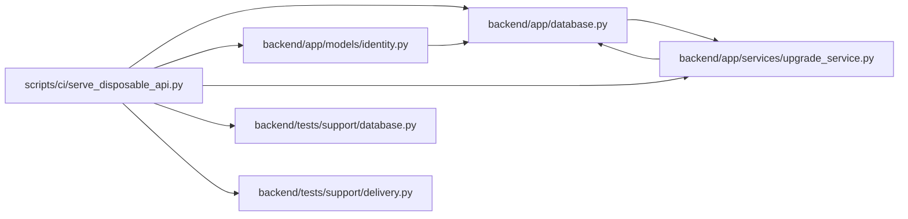

# serve_disposable_api Module

**Path:** `scripts/ci/serve_disposable_api.py`

## Description

Starts the real HTTP application after requiring an explicitly designated temporary SQLite target and isolated execution environment. Schema initialization and deterministic scenario data are created only for that disposable target, then the ordinary application lifespan serves requests.

## Imports

| Source | Symbols |
|--------|---------|
| `app.database` | `async_session_maker`, `close_database` |
| `app.models.identity` | `Principal`, `IdentitySubject`, `ProjectMembership`, `PrincipalProfileLink` |
| `app.services.upgrade_service` | `run_alembic_upgrade` |
| `asyncio` | `asyncio` |
| `os` | `os` |
| `pathlib` | `Path` |
| `subprocess` | `subprocess` |
| `sys` | `sys` |
| `tests.support.database` | `assert_safe_test_database_url` |
| `tests.support.delivery` | `seed_delivery_scenario` |
| `uvicorn` | `uvicorn` |

## Local dependency map

<!-- Auto-generated local dependency summary. Do not edit by hand. -->

### Internal neighbors

| Direction | Module |
|---|---|
| Outbound | [app_database](../modules/app_database.md) |
| Outbound | [models_identity](../modules/models_identity.md) |
| Outbound | [upgrade_service](../modules/upgrade_service.md) |
| Outbound | [support_database](../modules/support_database.md) |
| Outbound | [delivery](../modules/delivery.md) |

### External packages

| Language | Used packages | Undeclared packages |
|---|---:|---:|
| python | 2 | 2 |

## Functions

| Function | Signature | Decorators | Description |
|----------|-----------|------------|-------------|
| `main` | `()` | — | — |