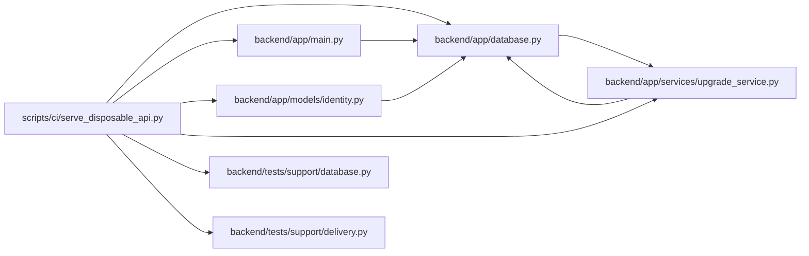

# serve_disposable_api Module

**Path:** `scripts/ci/serve_disposable_api.py`

## Description

Starts the real HTTP application against an explicitly designated temporary SQLite database, initializes its schema and fixture data, and binds loopback by default. The native runner supplies an invocation nonce that is returned in response headers before browser writes are allowed. Managed mode starts and stops a synthetic OIDC provider with matching issuer/profile links. This is an isolated application fixture, not a production-provider acceptance path.

## Imports

| Source | Symbols |
|--------|---------|
| `app.database` | `async_session_maker`, `close_database` |
| `app.main` | `app` |
| `app.models.identity` | `Principal`, `IdentitySubject`, `ProjectMembership`, `PrincipalProfileLink` |
| `app.services.upgrade_service` | `run_alembic_upgrade` |
| `asyncio` | `asyncio` |
| `os` | `os` |
| `pathlib` | `Path` |
| `subprocess` | `subprocess` |
| `sys` | `sys` |
| `tests.support.database` | `assert_safe_test_database_url` |
| `tests.support.delivery` | `seed_delivery_scenario` |
| `uvicorn` | `uvicorn` |

## Local dependency map

<!-- Auto-generated local dependency summary. Do not edit by hand. -->

### Internal neighbors

| Direction | Module |
|---|---|
| Outbound | [app_database](../modules/app_database.md) |
| Outbound | [app_main](../modules/app_main.md) |
| Outbound | [models_identity](../modules/models_identity.md) |
| Outbound | [upgrade_service](../modules/upgrade_service.md) |
| Outbound | [support_database](../modules/support_database.md) |
| Outbound | [delivery](../modules/delivery.md) |

### External packages

| Language | Used packages | Undeclared packages |
|---|---:|---:|
| python | 2 | 2 |

## Functions

| Function | Signature | Decorators | Description |
|----------|-----------|------------|-------------|
| `main` | `()` | — | — |