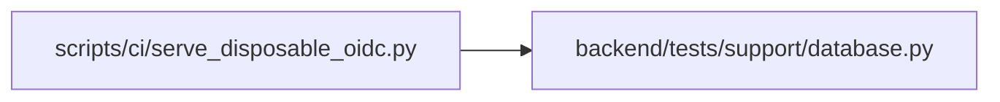

# serve_disposable_oidc Module

**Path:** `scripts/ci/serve_disposable_oidc.py`

## Description

Provides a synthetic OIDC issuer against an isolated SQLite database. The issuer is allowlisted to fixture addresses, binds loopback by default, and supports short-lived authorization codes, PKCE, nonce-bound tokens and controlled session expiry. Its fixture accounts and control credential are confined to development verification.

## Imports

| Source | Symbols |
|--------|---------|
| `base64` | `base64` |
| `cryptography.hazmat.primitives.asymmetric` | `rsa` |
| `fastapi` | `FastAPI`, `HTTPException`, `Request` |
| `fastapi.responses` | `HTMLResponse`, `RedirectResponse` |
| `hashlib` | `hashlib` |
| `html` | `html` |
| `json` | `json` |
| `jwt` | `jwt` |
| `os` | `os` |
| `secrets` | `secrets` |
| `sqlalchemy` | `create_engine`, `text` |
| `tests.support.database` | `assert_safe_test_database_url` |
| `time` | `time` |
| `urllib.parse` | `parse_qs`, `urlencode` |
| `uvicorn` | `uvicorn` |

## Local dependency map

<!-- Auto-generated local dependency summary. Do not edit by hand. -->

### Internal neighbors

| Direction | Module |
|---|---|
| Outbound | [support_database](../modules/support_database.md) |

### External packages

| Language | Used packages | Undeclared packages |
|---|---:|---:|
| python | 6 | 6 |

## Functions

| Function | Signature | Decorators | Description |
|----------|-----------|------------|-------------|
| `configuration` | `()` | `@app.get('/.well-known/openid-configuration')` | — |
| `keys` | `()` | `@app.get('/keys')` | — |
| `authorize` | `(request: Request)` | `@app.get('/authorize')` | — |
| `token` | *(async)* `(request: Request)` | `@app.post('/token')` | — |
| `expire` | *(async)* `(request: Request)` | `@app.post('/control/expire')` | Expire a fixture session without waiting eight hours during browser checks. |
