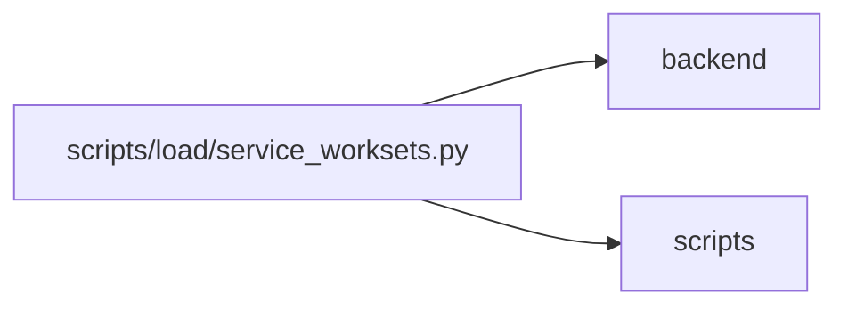

# service_worksets Module

**Path:** `scripts/load/service_worksets.py`

## Description

The service-only fixture is fenced by the repository test-database policy and records actual row counts, scoped synthetic authority, concurrent reads and rollback followed by independent readback. Its PostgreSQL distributions are not HTTP identity/latency evidence and cannot be combined into a people-capacity claim.

Owned cross-dialect service measurements, separate from HTTP and certification.

## Imports

| Source | Symbols |
|--------|---------|
| `app.authority` | `Authority` |
| `app.database` | `Base` |
| `app.models.agent` | `AgentRun` |
| `app.models.iteration` | `Iteration` |
| `app.models.task` | `Task` |
| `app.query_limits` | `CollectionLimitExceededError` |
| `app.services.capacity_service` | `CapacityService` |
| `app.services.delivery_metrics_service` | `DeliveryMetricsService` |
| `app.services.project_service` | `ProjectService` |
| `app.services.task_detail_service` | `TaskDetailService` |
| `app.services.task_service` | `TaskService` |
| `argparse` | `argparse` |
| `asyncio` | `asyncio` |
| `datetime` | `date` |
| `json` | `json` |
| `os` | `os` |
| `pathlib` | `Path` |
| `scripts.load.common` | `atomic_write_json` |
| `scripts.load.local_baseline` | `summarize` |
| `sqlalchemy` | `create_engine`, `text`, `select`, `func` |
| `sqlalchemy.ext.asyncio` | `create_async_engine`, `async_sessionmaker` |
| `tests.support.database` | `assert_safe_test_database_url` |
| `tests.support.delivery` | `seed_delivery_scenario` |
| `time` | `time` |

## Local dependency map

<!-- Auto-generated local dependency summary. Do not edit by hand. -->

> Module-level dependencies exceed the generated-diagram limits, so the diagram and table below group them by top-level package. Counts report the number of module neighbors in each package.

### Internal neighbors

| Direction | Module |
|---|---|
| Outbound | `backend` (13) |
| Outbound | `scripts` (2) |

### External packages

| Language | Used packages | Undeclared packages |
|---|---:|---:|
| python | 2 | 2 |

> All 15 module neighbor(s) are summarized by package because the module-level view exceeds the 12-node limit.

## Functions

| Function | Signature | Decorators | Description |
|----------|-----------|------------|-------------|
| `run` | *(async)* `(url, declaration)` | — | — |
| `main` | `()` | — | — |