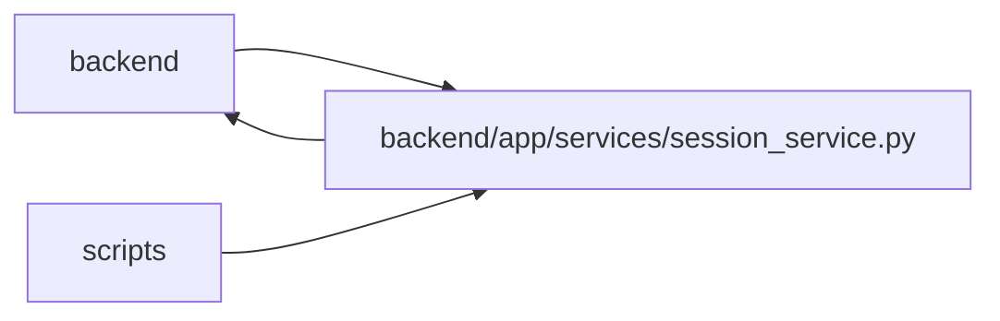

# session_service Module

**Path:** `backend/app/services/session_service.py`

## Description

Opaque browser-session resolution and trusted request audit metadata.

Opaque sessions remain distinct from authenticated principals. Rotation preserves authorized ownership while replacing the token and CSRF value; authenticated sessions use the human lifetime. Expired or revoked tokens cannot be rotated, and maintenance modes suppress implicit session writes.

## Imports

| Source | Symbols |
|--------|---------|
| `app.authority` | `AuthorityError`, `AuthorityError` |
| `app.commands` | `commit_or_flush` |
| `app.config` | `get_settings` |
| `app.database` | `get_db` |
| `app.maintenance` | `MaintenanceModeError` |
| `app.models.user_session` | `UserSession` |
| `app.runtime_telemetry` | `metrics` |
| `app.services.identity_service` | `require_identity_writes` |
| `app.utils.time` | `as_utc`, `utc_now` |
| `datetime` | `timedelta` |
| `fastapi` | `Depends`, `Request`, `Response` |
| `hashlib` | `hashlib` |
| `ipaddress` | `ip_address`, `ip_network` |
| `re` | `re` |
| `secrets` | `secrets` |
| `sqlalchemy` | `select` |
| `sqlalchemy.exc` | `IntegrityError` |
| `sqlalchemy.ext.asyncio` | `AsyncSession` |
| `typing` | `Annotated`, `Optional` |

## Local dependency map

<!-- Auto-generated local dependency summary. Do not edit by hand. -->

> Module-level dependencies exceed the generated-diagram limits, so the diagram and table below group them by top-level package. Counts report the number of module neighbors in each package.

### Internal neighbors

| Direction | Module |
|---|---|
| Inbound | `backend` (8) |
| Inbound | `scripts` (1) |
| Outbound | `backend` (9) |

### External packages

| Language | Used packages | Undeclared packages |
|---|---:|---:|
| python | 2 | 0 |

> All 18 module neighbor(s) are summarized by package because the module-level view exceeds the 12-node limit.

## Functions

| Function | Signature | Decorators | Description |
|----------|-----------|------------|-------------|
| `_token_digest` | `(token: str) -> str` | — | — |
| `_new_token` | `() -> str` | — | — |
| `_cookie_options` | `() -> dict` | — | — |
| `get_client_ip` | *(async)* `(request: Request) -> str` | — | Read proxy client metadata only from explicitly trusted immediate peers. |
| `_get_session_by_token` | *(async)* `(db: AsyncSession, token: str \| None) -> UserSession \| None` | — | — |
| `_create_session` | *(async)* `(db: AsyncSession, ip_address: str, user_agent: str \| None) -> tuple[UserSession, str]` | — | Create an isolated session, retrying the vanishingly rare unique collision. |
| `get_or_create_session` | *(async)* `(db: AsyncSession, ip_address: str, user_agent: Optional[str] = None, session_token: str \| None = None) -> tuple[UserSession, str]` | — | Resolve an opaque token or create a fresh session without IP ownership. |
| `get_current_session` | *(async)* `(request: Request, response: Response, db: Annotated[AsyncSession, Depends(get_db, scope='function')]) -> UserSession` | — | FastAPI dependency resolving the current browser and refreshing its cookie. |
| `rotate_session` | *(async)* `(db: AsyncSession, session: UserSession, response: Response) -> UserSession` | — | Rotate a raw token while preserving ownership links on the session row. |
| `revoke_session` | *(async)* `(db: AsyncSession, session: UserSession, response: Response) -> None` | — | Revoke the current browser identity and remove its cookie. |
| `get_session_by_ip` | *(async)* `(db: AsyncSession, ip_address: str) -> Optional[UserSession]` | — | Return the latest audit match; IP must never be used for authorization. |