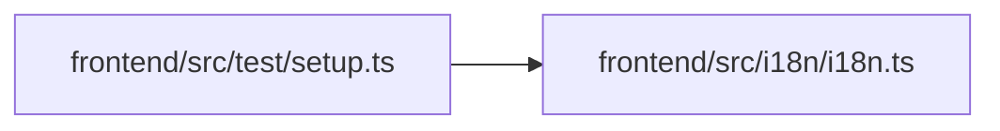

# setup Module

**Path:** `frontend/src/test/setup.ts`

## Description

_Auto-generated from `frontend/src/test/setup.ts`._

## Imports

| Source | Symbols |
|--------|---------|
| `../i18n/i18n` | `i18n` |
| `@testing-library/react` | `cleanup` |
| `vitest` | `afterEach` |

## Module Signals

| Signal | Values |
|--------|--------|
| Module calls | `afterEach` |

## Local dependency map

<!-- Auto-generated local dependency summary. Do not edit by hand. -->

### Internal neighbors

| Direction | Module |
|---|---|
| Outbound | [i18n](../modules/i18n.md) |

### External packages

| Language | Used packages | Undeclared packages |
|---|---:|---:|
| typescript | 2 | 0 |
