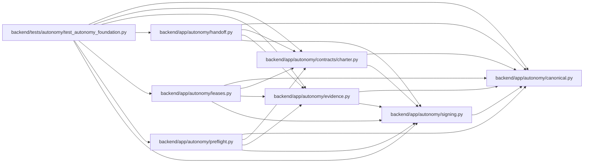

# signing Module

**Path:** `backend/app/autonomy/signing.py`

## Description

Detached remote-signing envelopes and pinned public-key verification.

## Imports

| Source | Symbols |
|--------|---------|
| `__future__` | `annotations` |
| `app.autonomy.canonical` | `StrictContractModel`, `sha256_hex` |
| `base64` | `base64` |
| `binascii` | `binascii` |
| `collections.abc` | `Callable` |
| `cryptography.exceptions` | `InvalidSignature` |
| `cryptography.hazmat.primitives` | `hashes`, `serialization` |
| `cryptography.hazmat.primitives.asymmetric` | `ec`, `ed25519`, `padding`, `rsa` |
| `dataclasses` | `dataclass` |
| `pydantic` | `Field`, `field_validator` |
| `re` | `re` |
| `typing` | `Literal`, `Protocol`, `runtime_checkable` |

## Local dependency map

<!-- Auto-generated local dependency summary. Do not edit by hand. -->

### Internal neighbors

| Direction | Module |
|---|---|
| Inbound | [charter](../modules/charter.md) |
| Inbound | [evidence](../modules/evidence.md) |
| Inbound | [handoff](../modules/handoff.md) |
| Inbound | [leases](../modules/leases.md) |
| Inbound | [preflight](../modules/preflight.md) |
| Inbound | [test_autonomy_foundation](../modules/test_autonomy_foundation.md) |
| Outbound | [autonomy_canonical](../modules/autonomy_canonical.md) |

### External packages

| Language | Used packages | Undeclared packages |
|---|---:|---:|
| python | 2 | 0 |

## Classes

| Class | Line | Bases | Description |
|-------|------|-------|-------------|
| [DetachedSignatureEnvelope](../entities/DetachedSignatureEnvelope.md) | 24 | `StrictContractModel` | Provider-neutral signature metadata without an embedded trust key. |
| [PublicTrustAnchor](../entities/PublicTrustAnchor.md) | 48 | `StrictContractModel` | A public key returned by a separately trusted resolver. |
| [PublicTrustResolver](../entities/PublicTrustResolver.md) | 70 | `Protocol` | Resolve a current public key from an external trust source. |
| [RemoteSigner](../entities/RemoteSigner.md) | 77 | `Protocol` | Sign a digest through a non-exportable external key service. |
| [SignatureVerificationError](../entities/SignatureVerificationError.md) | 89 | `ValueError` | Raised when a detached remote signature fails closed. |
| [CallableTrustResolver](../entities/CallableTrustResolver.md) | 154 | — | Small adapter for provider SDK integrations and deterministic tests. |

## Functions

| Function | Signature | Decorators | Description |
|----------|-----------|------------|-------------|
| `verify_detached_signature` | `(payload: bytes, envelope: DetachedSignatureEnvelope, resolver: PublicTrustResolver) -> PublicTrustAnchor` | — | Verify digest, trust metadata, key type, and detached signature. |
| `validate_sha256` | `(value: str, *, field_name: str = 'digest') -> str` | — | Validate a lowercase SHA-256 string at non-Pydantic boundaries. |
