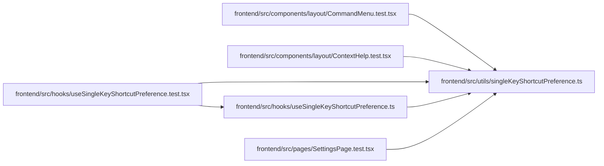

# singleKeyShortcutPreference Module

**Path:** `frontend/src/utils/singleKeyShortcutPreference.ts`

## Description

_Auto-generated from `frontend/src/utils/singleKeyShortcutPreference.ts`._

## Module Signals

| Signal | Values |
|--------|--------|
| Exports | `SINGLE_KEY_SHORTCUTS_CHANGED_EVENT`, `SINGLE_KEY_SHORTCUTS_STORAGE_KEY`, `readSingleKeyShortcutsEnabled`, `writeSingleKeyShortcutsEnabled` |
| Constants | `SINGLE_KEY_SHORTCUTS_STORAGE_KEY`, `SINGLE_KEY_SHORTCUTS_CHANGED_EVENT` |

## Local dependency map

<!-- Auto-generated local dependency summary. Do not edit by hand. -->

### Internal neighbors

| Direction | Module |
|---|---|
| Inbound | [CommandMenu.test](../modules/CommandMenu.test.md) |
| Inbound | [ContextHelp.test](../modules/ContextHelp.test.md) |
| Inbound | [useSingleKeyShortcutPreference.test](../modules/useSingleKeyShortcutPreference.test.md) |
| Inbound | [useSingleKeyShortcutPreference](../modules/useSingleKeyShortcutPreference.md) |
| Inbound | [SettingsPage.test](../modules/SettingsPage.test.md) |

## Functions

| Function | Signature | Decorators | Description |
|----------|-----------|------------|-------------|
| `readSingleKeyShortcutsEnabled` | `()` | — | — |
| `writeSingleKeyShortcutsEnabled` | `(enabled: boolean)` | — | — |
