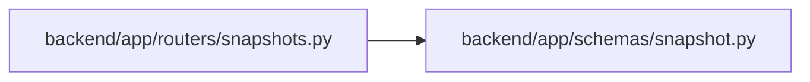

# snapshot Module

**Path:** `backend/app/schemas/snapshot.py`

## Description

Snapshot restore API schemas.

## Imports

| Source | Symbols |
|--------|---------|
| `pydantic` | `BaseModel`, `Field` |

## Local dependency map

<!-- Auto-generated local dependency summary. Do not edit by hand. -->

### Internal neighbors

| Direction | Module |
|---|---|
| Inbound | [snapshots](../modules/snapshots.md) |

### External packages

| Language | Used packages | Undeclared packages |
|---|---:|---:|
| python | 1 | 0 |

## Classes

| Class | Line | Bases | Description |
|-------|------|-------|-------------|
| [SnapshotRestoreRequest](../entities/SnapshotRestoreRequest.md) | 6 | `BaseModel` | Explicit acknowledgement required before destructive snapshot restore. |
| [SnapshotRestoreResponse](../entities/snapshot_SnapshotRestoreResponse.md) | 13 | `BaseModel` | Recoverable and auditable result of a completed snapshot restore. |
