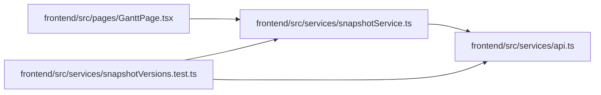

# snapshotService Module

**Path:** `frontend/src/services/snapshotService.ts`

## Description

_Auto-generated from `frontend/src/services/snapshotService.ts`._

## Imports

| Source | Symbols |
|--------|---------|
| `./api` | `api` |

## Module Signals

| Signal | Values |
|--------|--------|
| Exports | `IterationSnapshot`, `SnapshotRestoreResponse`, `snapshotService` |
| Constants | `snapshotService` |

## Local dependency map

<!-- Auto-generated local dependency summary. Do not edit by hand. -->

### Internal neighbors

| Direction | Module |
|---|---|
| Inbound | [GanttPage](../modules/GanttPage.md) |
| Inbound | [snapshotVersions.test](../modules/snapshotVersions.test.md) |
| Outbound | [api](../modules/api.md) |

## Classes

| Class | Kind | Line | Bases / Target | Description |
|-------|------|------|----------------|-------------|
| [IterationSnapshot](../entities/IterationSnapshot.md) | Class | 3 | — | — |
| [SnapshotRestoreResponse](../entities/snapshotService_SnapshotRestoreResponse.md) | Class | 10 | — | — |
