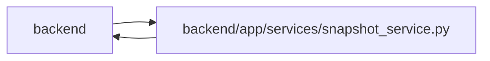

# snapshot_service Module

**Path:** `backend/app/services/snapshot_service.py`

## Description

Scheduled restoration appends a per-task restoration event after rebuilding the task state. This marks an execution-history boundary without inventing a new capture time or acceptance, while retaining the existing aggregate recovery audit and version-allocation safeguards.

Stores bounded recovery points within the owning planning transaction. Iteration restoration preserves current shared person availability and delivery prerequisites, while legacy unlinked allocation absences retain local recovery. Incoming delivery references block destructive restoration. Restored task versions exceed retained fences and history; current evidence and acceptance are invalidated.

Restoration reconciles the exact saved allocation membership. Safe allocations created after capture detach from the iteration while retaining their identifiers, profiles and global/history references. Complete registered and physical reference ownership is checked before recovery mutation; external task, live assignment, run or evaluating-package references block incompatible restoration. Current shared profiles, availability and canonical absences are preserved.

Allocation recovery validates stable lifetime provenance before any writes, preserves global owner references, and recreates deleted allocations with their saved lifetime. Snapshots lacking lifetime provenance remain immutable and require explicit reconciliation before restore.

## Imports

| Source | Symbols |
|--------|---------|
| `app.commands` | `atomic_command`, `current_command`, `lock_iterations` |
| `app.config` | `get_settings` |
| `app.models.recovery` | `ApplicationSnapshot`, `LegacySnapshotImport` |
| `app.services.iteration_service` | `IterationService` |
| `app.services.team_service` | `TeamService` |
| `app.utils.time` | `utc_now` |
| `datetime` | `datetime`, `timedelta` |
| `hashlib` | `hashlib` |
| `json` | `json` |
| `pathlib` | `Path` |
| `re` | `re` |
| `sqlalchemy` | `select`, `delete` |
| `sqlalchemy.ext.asyncio` | `AsyncSession` |

## Local dependency map

<!-- Auto-generated local dependency summary. Do not edit by hand. -->

> Module-level dependencies exceed the generated-diagram limits, so the diagram and table below group them by top-level package. Counts report the number of module neighbors in each package.

### Internal neighbors

| Direction | Module |
|---|---|
| Inbound | `backend` (15) |
| Outbound | `backend` (6) |

### External packages

| Language | Used packages | Undeclared packages |
|---|---:|---:|
| python | 1 | 0 |

> All 20 module neighbor(s) are summarized by package because the module-level view exceeds the 12-node limit.

## Classes

| Class | Line | Bases | Description |
|-------|------|-------|-------------|
| [SnapshotPathError](../entities/SnapshotPathError.md) | 27 | `ValueError` | Raised when a snapshot name cannot be safely resolved inside its iteration directory. |
| [SnapshotService](../entities/SnapshotService.md) | 31 | — | Service for creating and managing iteration snapshots. |