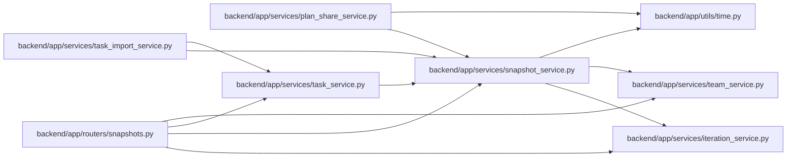

# snapshot_service Module

**Path:** `backend/app/services/snapshot_service.py`

## Description

Snapshot service for iteration state backups.

## Imports

| Source | Symbols |
|--------|---------|
| `app.services.iteration_service` | `IterationService` |
| `app.services.team_service` | `TeamService` |
| `app.utils.time` | `utc_now` |
| `datetime` | `timedelta` |
| `json` | `json` |
| `pathlib` | `Path` |
| `re` | `re` |
| `sqlalchemy.ext.asyncio` | `AsyncSession` |

## Local dependency map

<!-- Auto-generated local dependency summary. Do not edit by hand. -->

### Internal neighbors

| Direction | Module |
|---|---|
| Inbound | [snapshots](../modules/snapshots.md) |
| Inbound | [plan_share_service](../modules/plan_share_service.md) |
| Inbound | [task_import_service](../modules/task_import_service.md) |
| Inbound | [task_service](../modules/task_service.md) |
| Outbound | [iteration_service](../modules/iteration_service.md) |
| Outbound | [team_service](../modules/team_service.md) |
| Outbound | [time](../modules/time.md) |

### External packages

| Language | Used packages | Undeclared packages |
|---|---:|---:|
| python | 1 | 0 |

## Classes

| Class | Line | Bases | Description |
|-------|------|-------|-------------|
| [SnapshotPathError](../entities/SnapshotPathError.md) | 22 | `ValueError` | Raised when a snapshot name cannot be safely resolved inside its iteration directory. |
| [SnapshotService](../entities/SnapshotService.md) | 26 | — | Service for creating and managing iteration snapshots. |
