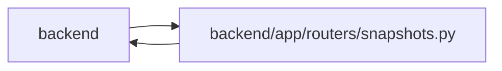

# snapshots Module

**Path:** `backend/app/routers/snapshots.py`

## Description

Snapshots API router.

## Imports

| Source | Symbols |
|--------|---------|
| `app.database` | `get_db` |
| `app.routers.export` | `_optional_int`, `_process_import`, `_validate_import_task_tree` |
| `app.schemas.snapshot` | `SnapshotRestoreRequest`, `SnapshotRestoreResponse` |
| `app.schemas.task` | `TaskCreate`, `TaskStatus` |
| `app.schemas.team` | `TeamMemberCreate`, `VacationCreate` |
| `app.security` | `require_admin_api_key` |
| `app.services.iteration_service` | `IterationService` |
| `app.services.snapshot_service` | `SnapshotPathError`, `SnapshotService` |
| `app.services.task_service` | `TaskService` |
| `app.services.team_service` | `TeamService` |
| `datetime` | `date` |
| `fastapi` | `APIRouter`, `Depends`, `HTTPException`, `status` |
| `pydantic` | `ValidationError` |
| `sqlalchemy.ext.asyncio` | `AsyncSession` |
| `typing` | `Annotated` |

## Local dependency map

<!-- Auto-generated local dependency summary. Do not edit by hand. -->

> Module-level dependencies exceed the generated-diagram limits, so the diagram and table below group them by top-level package. Counts report the number of module neighbors in each package.

### Internal neighbors

| Direction | Module |
|---|---|
| Inbound | `backend` (2) |
| Outbound | `backend` (10) |

### External packages

| Language | Used packages | Undeclared packages |
|---|---:|---:|
| python | 3 | 0 |

> All 12 module neighbor(s) are summarized by package because the module-level view exceeds the 12-node limit.

## Functions

| Function | Signature | Decorators | Description |
|----------|-----------|------------|-------------|
| `_validate_snapshot_task_payloads` | *(async)* `(iteration_id: int, snapshot_data: dict, task_service: TaskService) -> None` | — | Validate snapshot structure and references before clearing current state. |
| `list_snapshots` | *(async)* `(iteration_id: int, db: Annotated[AsyncSession, Depends(get_db)])` | `@router.get('/iterations/{iteration_id}/snapshots')` | List available snapshots for an iteration. |
| `restore_snapshot` | *(async)* `(iteration_id: int, filename: str, data: SnapshotRestoreRequest, db: Annotated[AsyncSession, Depends(get_db)], _admin: Annotated[None, Depends(require_admin_api_key)])` | `@router.post('/iterations/{iteration_id}/snapshots/{filename}/restore', response_model=SnapshotRestoreResponse)` | Restore iteration state from a snapshot. |
