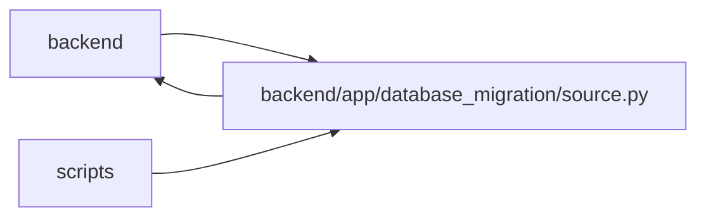

# source Module

**Path:** `backend/app/database_migration/source.py`

## Description

Read-only SQLite snapshot creation and source preflight. Project identity qualification runs before snapshot capture and refuses ambiguous retained scope without changing the source. The manifest includes the independently measured project allocation floor, including SQLite sequence progress, and the completed snapshot must reproduce that floor.

## Imports

| Source | Symbols |
|--------|---------|
| `__future__` | `annotations` |
| `app.database_migration.canonical` | `canonical_value`, `digest_rows` |
| `app.database_migration.catalog` | `TEXT_JSON_COLUMNS`, `TRANSFER_CATALOG_VERSION`, `application_tables`, `catalog_entries`, `column_family`, `column_max_length`, `transfer_order`, `transfer_tables` |
| `app.database_migration.manifest` | `ManifestError`, `canonical_json_bytes`, `read_document`, `sha256_bytes`, `verify_document`, `write_document` |
| `app.database_migration.project_identity` | `ProjectIdentityError`, `sqlite_project_allocation_floor` |
| `app.services.upgrade_service` | `head_revision` |
| `contextlib` | `contextmanager` |
| `datetime` | `UTC`, `datetime`, `timedelta` |
| `hashlib` | `hashlib` |
| `json` | `json` |
| `os` | `os` |
| `pathlib` | `Path` |
| `shutil` | `shutil` |
| `sqlalchemy` | `Index`, `UniqueConstraint` |
| `sqlalchemy.dialects` | `sqlite` |
| `sqlalchemy.exc` | `DatabaseError` |
| `sqlalchemy.sql.schema` | `Table` |
| `sqlite3` | `sqlite3` |
| `typing` | `Any`, `Iterator`, `Mapping` |
| `urllib.parse` | `quote` |

## Local dependency map

<!-- Auto-generated local dependency summary. Do not edit by hand. -->

> Module-level dependencies exceed the generated-diagram limits, so the diagram and table below group them by top-level package. Counts report the number of module neighbors in each package.

### Internal neighbors

| Direction | Module |
|---|---|
| Inbound | `backend` (6) |
| Inbound | `scripts` (1) |
| Outbound | `backend` (5) |

### External packages

| Language | Used packages | Undeclared packages |
|---|---:|---:|
| python | 1 | 0 |

> All 12 module neighbor(s) are summarized by package because the module-level view exceeds the 12-node limit.

## Classes

| Class | Line | Bases | Description |
|-------|------|-------|-------------|
| [MigrationDataError](../entities/MigrationDataError.md) | 49 | `RuntimeError` | A fail-closed source, transfer, or reconciliation condition. |

## Functions

| Function | Signature | Decorators | Description |
|----------|-----------|------------|-------------|
| `_quoted` | `(identifier: str) -> str` | — | — |
| `_file_sha256` | `(path: Path) -> str` | — | — |
| `_source_file_set` | `(path: Path) -> dict[str, dict[str, Any]]` | — | — |
| `read_only_sqlite` | `(path: Path) -> Iterator[sqlite3.Connection]` | `@contextmanager` | Open an existing SQLite database with URI-enforced read-only access. |
| `_parse_utc` | `(value: Any, *, field: str) -> datetime` | — | — |
| `validate_writer_drain_evidence` | `(document: Mapping[str, Any], *, now: datetime \| None = None) -> str` | — | Validate controller plus all-replica writer-drain evidence. |
| `_snapshot_database` | `(source: Path, destination: Path) -> None` | — | — |
| `_table_names` | `(connection: sqlite3.Connection) -> set[str]` | — | — |
| `_rows` | `(connection: sqlite3.Connection, table: Table) -> Iterator[Mapping[str, Any]]` | — | — |
| `_validate_inventory` | `(connection: sqlite3.Connection) -> str` | — | — |
| `_validate_integrity` | `(connection: sqlite3.Connection) -> None` | — | — |
| `_validate_orphans` | `(connection: sqlite3.Connection) -> None` | — | — |
| `_validate_keys` | `(connection: sqlite3.Connection) -> None` | — | — |
| `_validate_task_graphs` | `(connection: sqlite3.Connection) -> None` | — | — |
| `_validate_values` | `(connection: sqlite3.Connection) -> None` | — | — |
| `_inspect_snapshot` | `(connection: sqlite3.Connection) -> tuple[str, dict[str, Any]]` | — | — |
| `preflight_source` | `(*, source_path: Path, snapshot_path: Path, writer_drain_evidence_path: Path, manifest_path: Path, now: datetime \| None = None) -> dict[str, Any]` | — | Create, validate, and manifest a stable SQLite migration snapshot. |
