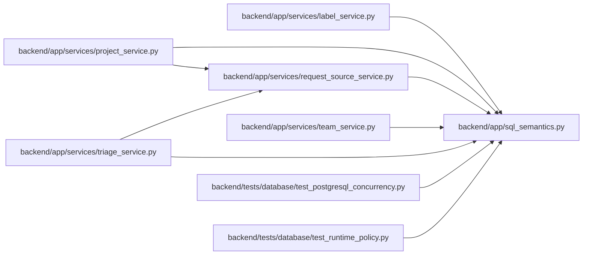

# sql_semantics Module

**Path:** `backend/app/sql_semantics.py`

## Description

Cross-dialect text matching rules for the supported SQLite/PostgreSQL window.

## Imports

| Source | Symbols |
|--------|---------|
| `__future__` | `annotations` |
| `sqlalchemy` | `func` |
| `typing` | `Any` |
| `unicodedata` | `unicodedata` |

## Local dependency map

<!-- Auto-generated local dependency summary. Do not edit by hand. -->

### Internal neighbors

| Direction | Module |
|---|---|
| Inbound | [label_service](../modules/label_service.md) |
| Inbound | [project_service](../modules/project_service.md) |
| Inbound | [request_source_service](../modules/request_source_service.md) |
| Inbound | [team_service](../modules/team_service.md) |
| Inbound | [triage_service](../modules/triage_service.md) |
| Inbound | [test_postgresql_concurrency](../modules/test_postgresql_concurrency.md) |
| Inbound | [test_runtime_policy](../modules/test_runtime_policy.md) |

### External packages

| Language | Used packages | Undeclared packages |
|---|---:|---:|
| python | 1 | 0 |

## Functions

| Function | Signature | Decorators | Description |
|----------|-----------|------------|-------------|
| `normalize_text` | `(value: str) -> str` | — | Normalize user search input without database-collation assumptions. |
| `_escaped_like` | `(value: str) -> str` | — | — |
| `portable_contains` | `(column: Any, value: str) -> Any` | — | Return the frozen portable substring contract. |
| `portable_case_insensitive_equal` | `(column: Any, value: str) -> Any` | — | Match ASCII identifiers case-insensitively and Unicode identifiers exactly. |
