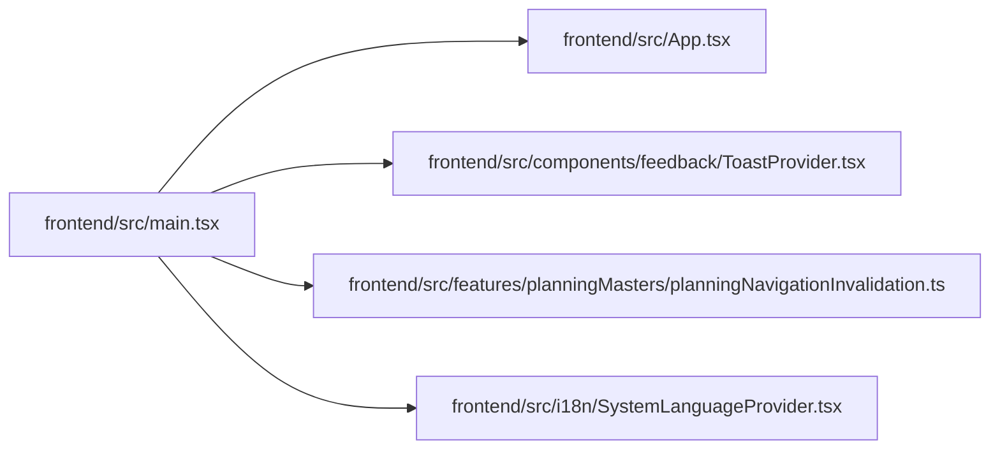

# main Module

**Path:** `frontend/src/main.tsx`

## Description

_Auto-generated from `frontend/src/main.tsx`._

## Imports

| Source | Symbols |
|--------|---------|
| `./App` | `App` |
| `./components/feedback/ToastProvider` | `ToastProvider` |
| `./features/planningMasters/planningNavigationInvalidation` | `installPlanningNavigationInvalidation` |
| `./i18n/SystemLanguageProvider` | `SystemLanguageProvider` |
| `@tanstack/react-query` | `QueryClient`, `QueryClientProvider` |
| `react` | `React` |
| `react-dom/client` | `ReactDOM` |
| `react-router-dom` | `BrowserRouter` |

## Module Signals

| Signal | Values |
|--------|--------|
| Constants | `queryClient` |
| Module calls | `queryClient = QueryClient`, `installPlanningNavigationInvalidation`, `render` |

## Local dependency map

<!-- Auto-generated local dependency summary. Do not edit by hand. -->

### Internal neighbors

| Direction | Module |
|---|---|
| Outbound | [App](../modules/App.md) |
| Outbound | [ToastProvider](../modules/ToastProvider.md) |
| Outbound | [planningNavigationInvalidation](../modules/planningNavigationInvalidation.md) |
| Outbound | [SystemLanguageProvider](../modules/SystemLanguageProvider.md) |

### External packages

| Language | Used packages | Undeclared packages |
|---|---:|---:|
| typescript | 4 | 0 |
