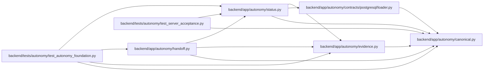

# status Module

**Path:** `backend/app/autonomy/status.py`

## Description

Deterministic DBM task/gate status amendment evaluation.

## Imports

| Source | Symbols |
|--------|---------|
| `__future__` | `annotations` |
| `app.autonomy.canonical` | `StrictContractModel`, `canonical_json_bytes`, `sha256_hex` |
| `app.autonomy.contracts.postgresql.loader` | `PostgreSQLContractBundle` |
| `app.autonomy.evidence` | `SignedAutonomousEvidence` |
| `datetime` | `UTC`, `datetime` |
| `pydantic` | `Field`, `model_validator` |
| `re` | `re` |
| `typing` | `Literal` |

## Local dependency map

<!-- Auto-generated local dependency summary. Do not edit by hand. -->

### Internal neighbors

| Direction | Module |
|---|---|
| Inbound | [handoff](../modules/handoff.md) |
| Inbound | [test_autonomy_foundation](../modules/test_autonomy_foundation.md) |
| Inbound | [test_server_acceptance](../modules/test_server_acceptance.md) |
| Outbound | [autonomy_canonical](../modules/autonomy_canonical.md) |
| Outbound | [loader](../modules/loader.md) |
| Outbound | [evidence](../modules/evidence.md) |

### External packages

| Language | Used packages | Undeclared packages |
|---|---:|---:|
| python | 1 | 0 |

## Classes

| Class | Line | Bases | Description |
|-------|------|-------|-------------|
| [StatusRule](../entities/StatusRule.md) | 20 | `StrictContractModel` | — |
| [StatusRulesContract](../entities/StatusRulesContract.md) | 28 | `StrictContractModel` | — |
| [ResolvedStatusEvidence](../entities/ResolvedStatusEvidence.md) | 45 | `StrictContractModel` | A resolver-produced reference to one signed immutable source envelope. |
| [StatusEvidenceReference](../entities/StatusEvidenceReference.md) | 72 | `StrictContractModel` | — |
| [TaskStatusAmendment](../entities/TaskStatusAmendment.md) | 82 | `StrictContractModel` | — |
| [GateStatusAmendment](../entities/GateStatusAmendment.md) | 94 | `StrictContractModel` | — |
| [StatusAmendmentLedger](../entities/StatusAmendmentLedger.md) | 104 | `StrictContractModel` | — |

## Functions

| Function | Signature | Decorators | Description |
|----------|-----------|------------|-------------|
| `evaluate_status_amendment` | `(*, bundle: PostgreSQLContractBundle, release_fingerprint: str, charter_digest: str, source_status_snapshot_digest: str, resolved_evidence: tuple[ResolvedStatusEvidence, ...] = (), generated_at: datetime \| None = None) -> StatusAmendmentLedger` | — | Derive conservative task/gate truth; evidence absence can never pass. |
| `_reference` | `(item: ResolvedStatusEvidence) -> StatusEvidenceReference` | — | — |
| `_task_row` | `(rule: StatusRule, by_kind: dict[str, ResolvedStatusEvidence]) -> TaskStatusAmendment` | — | — |
| `_gate_row` | `(rule: StatusRule, by_kind: dict[str, ResolvedStatusEvidence]) -> GateStatusAmendment` | — | — |
