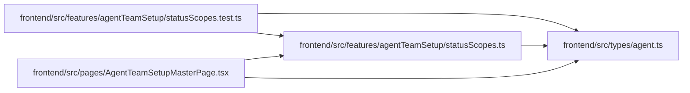

# statusScopes Module

**Path:** `frontend/src/features/agentTeamSetup/statusScopes.ts`

## Description

_Auto-generated from `frontend/src/features/agentTeamSetup/statusScopes.ts`._

## Imports

| Source | Symbols |
|--------|---------|
| `../../types/agent` | `AgentTeamStatus` |

## Module Signals

| Signal | Values |
|--------|--------|
| Exports | `AgentTeamStatusScopes`, `RuntimeReadinessState`, `SessionAuthorityState`, `TopologyConfigurationState`, `deriveAgentTeamStatusScopes` |

## Local dependency map

<!-- Auto-generated local dependency summary. Do not edit by hand. -->

### Internal neighbors

| Direction | Module |
|---|---|
| Inbound | [statusScopes.test](../modules/statusScopes.test.md) |
| Inbound | [AgentTeamSetupMasterPage](../modules/AgentTeamSetupMasterPage.md) |
| Outbound | [types_agent](../modules/types_agent.md) |

## Classes

| Class | Kind | Line | Bases / Target | Description |
|-------|------|------|----------------|-------------|
| [AgentTeamStatusScopes](../entities/AgentTeamStatusScopes.md) | Class | 23 | — | — |
| [TopologyConfigurationState](../entities/TopologyConfigurationState.md) | Type alias | 3 | — | — |
| [SessionAuthorityState](../entities/SessionAuthorityState.md) | Type alias | 10 | — | — |
| [RuntimeReadinessState](../entities/RuntimeReadinessState.md) | Type alias | 16 | — | — |

## Functions

| Function | Signature | Decorators | Description |
|----------|-----------|------------|-------------|
| `deriveAgentTeamStatusScopes` | `({     status,     isLoading, }: {     status: AgentTeamStatus \| undefined;     isLoading: boolean; }) -> AgentTeamStatusScopes` | — | — |
