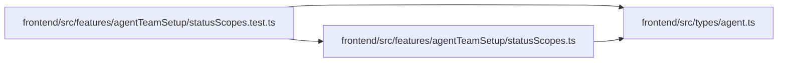

# statusScopes.test Module

**Path:** `frontend/src/features/agentTeamSetup/statusScopes.test.ts`

## Description

_Auto-generated from `frontend/src/features/agentTeamSetup/statusScopes.test.ts`._

## Imports

| Source | Symbols |
|--------|---------|
| `../../types/agent` | `AgentTeamStatus` |
| `./statusScopes` | `deriveAgentTeamStatusScopes` |
| `vitest` | `describe`, `expect`, `it` |

## Module Signals

| Signal | Values |
|--------|--------|
| Module calls | `describe` |

## Local dependency map

<!-- Auto-generated local dependency summary. Do not edit by hand. -->

### Internal neighbors

| Direction | Module |
|---|---|
| Outbound | [statusScopes](../modules/statusScopes.md) |
| Outbound | [types_agent](../modules/types_agent.md) |

### External packages

| Language | Used packages | Undeclared packages |
|---|---:|---:|
| typescript | 1 | 0 |
