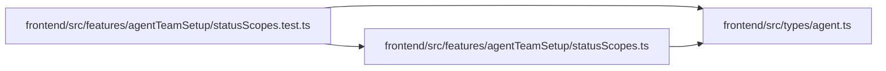

# statusScopes.test Module

**Path:** `frontend/src/features/agentTeamSetup/statusScopes.test.ts`

## Description

_Auto-generated from `frontend/src/features/agentTeamSetup/statusScopes.test.ts`._

## Imports

| Source | Symbols | Type-only | Runtime emission |
|--------|---------|-----------|------------------|
| `../../types/agent` | `AgentTeamStatus` | Declaration | erased |
| `./statusScopes` | `deriveAgentTeamStatusScopes` | — | compiler-dependent |
| `vitest` | `describe`, `expect`, `it` | — | compiler-dependent |

## Module Signals

| Signal | Values |
|--------|--------|
| Module calls | `describe` |

## Local dependency map

<!-- Auto-generated local dependency summary. Do not edit by hand. -->
This graph shows full source coupling. Type dependencies can be erased; compiler-dependent cycle groups are runtime candidates, not confirmed initialization cycles.

```mermaid
flowchart LR
    n0["frontend/src/features/agentTeamSetup/statusScopes.test.ts"]
    n1["frontend/src/features/agentTeamSetup/statusScopes.ts"]
    n2["frontend/src/types/agent.ts"]
    n0 --> n1
    n0 --> n2
    n1 --> n2
    click n0 "../modules/statusScopes.test.md"
    click n1 "../modules/statusScopes.md"
    click n2 "../modules/types_agent.md"
```

### Internal neighbors

| Direction | Module |
|---|---|
| Outbound | [statusScopes](../modules/statusScopes.md) |
| Outbound | [types_agent](../modules/types_agent.md) |

### External packages

| Language | Used packages | Undeclared packages |
|---|---:|---:|
| typescript | 1 | 0 |
