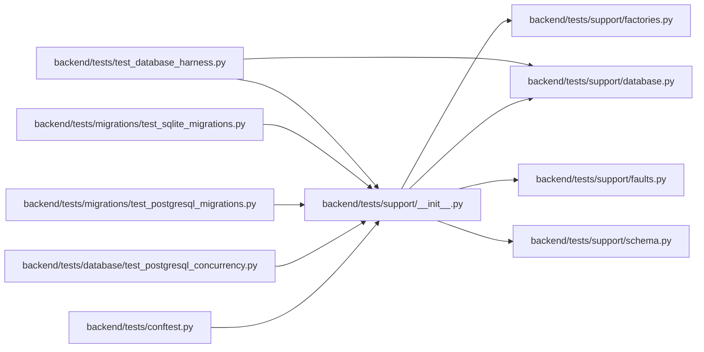

# __init__ Module

**Path:** `backend/tests/support/__init__.py`

## Description

Reusable test infrastructure for database and concurrency qualification.

## Imports

| Source | Symbols |
|--------|---------|
| `.database` | `PostgresTestDatabase`, `PostgresTestDatabaseManager`, `UnsafeDatabaseTarget`, `assert_safe_test_database_url` |
| `.factories` | `LegacySQLiteFactory`, `MappedModelFactory` |
| `.faults` | `AsyncBarrier`, `FailureInjector`, `FrozenClock` |
| `.schema` | `cross_dialect_schema_diff`, `schema_snapshot` |

## Local dependency map

<!-- Auto-generated local dependency summary. Do not edit by hand. -->

### Internal neighbors

| Direction | Module |
|---|---|
| Inbound | [conftest](../modules/conftest.md) |
| Inbound | [test_postgresql_concurrency](../modules/test_postgresql_concurrency.md) |
| Inbound | [test_postgresql_migrations](../modules/test_postgresql_migrations.md) |
| Inbound | [test_sqlite_migrations](../modules/test_sqlite_migrations.md) |
| Inbound | [test_database_harness](../modules/test_database_harness.md) |
| Outbound | [support_database](../modules/support_database.md) |
| Outbound | [factories](../modules/factories.md) |
| Outbound | [faults](../modules/faults.md) |
| Outbound | [schema](../modules/schema.md) |
