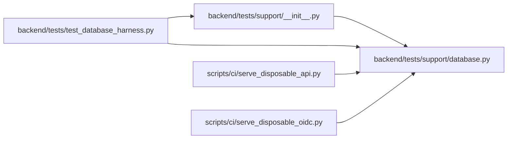

# database Module

**Path:** `backend/tests/support/database.py`

## Description

Safety-fenced lifecycle management for disposable test databases.

## Imports

| Source | Symbols |
|--------|---------|
| `__future__` | `annotations` |
| `contextlib` | `contextmanager` |
| `dataclasses` | `dataclass` |
| `os` | `os` |
| `pathlib` | `Path` |
| `re` | `re` |
| `sqlalchemy.engine` | `URL`, `make_url` |
| `tempfile` | `tempfile` |
| `typing` | `Iterator` |
| `uuid` | `uuid4` |

## Local dependency map

<!-- Auto-generated local dependency summary. Do not edit by hand. -->

### Internal neighbors

| Direction | Module |
|---|---|
| Inbound | [support___init__](../modules/support___init__.md) |
| Inbound | [test_database_harness](../modules/test_database_harness.md) |
| Inbound | [serve_disposable_api](../modules/serve_disposable_api.md) |
| Inbound | [serve_disposable_oidc](../modules/serve_disposable_oidc.md) |

### External packages

| Language | Used packages | Undeclared packages |
|---|---:|---:|
| python | 1 | 0 |

## Classes

| Class | Line | Bases | Description |
|-------|------|-------|-------------|
| [UnsafeDatabaseTarget](../entities/UnsafeDatabaseTarget.md) | 27 | `RuntimeError` | Raised before a fixture could touch a non-test database target. |
| [PostgresTestDatabase](../entities/PostgresTestDatabase.md) | 98 | — | One uniquely named PostgreSQL database owned by a fixture. |
| [PostgresTestDatabaseManager](../entities/PostgresTestDatabaseManager.md) | 119 | — | Create and drop isolated PostgreSQL databases through a local admin URL. |

## Functions

| Function | Signature | Decorators | Description |
|----------|-----------|------------|-------------|
| `_deployment_environment` | `(explicit: str \| None) -> str` | — | — |
| `assert_safe_test_database_url` | `(database_url: str \| URL, *, deployment_environment: str \| None = None, allowed_postgres_hosts: frozenset[str] = DEFAULT_POSTGRES_HOSTS, allowed_sqlite_root: Path \| None = None) -> URL` | — | Return a parsed URL only when it is unambiguously test-owned. |
| `_render` | `(url: URL) -> str` | — | — |
| `_psycopg_render` | `(url: URL) -> str` | — | Render a SQLAlchemy Psycopg URL as a libpq/Psycopg connection URL. |
