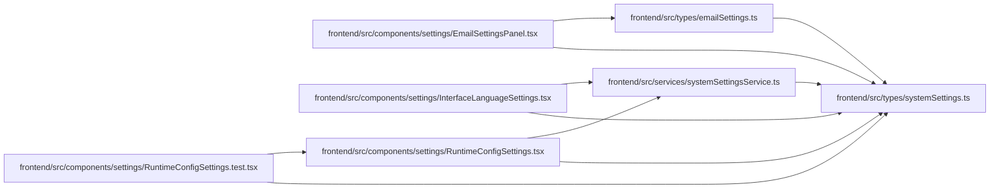

# systemSettings Module

**Path:** `frontend/src/types/systemSettings.ts`

## Description

_Auto-generated from `frontend/src/types/systemSettings.ts`._

## Module Signals

| Signal | Values |
|--------|--------|
| Exports | `AILanguageMode`, `AppRuntimeSettings`, `AppRuntimeSettingsUpdate`, `GitHubRuntimeSettings`, `GitHubRuntimeSettingsUpdate`, `LLMProvider`, `LLMRuntimeSettings`, `LLMRuntimeSettingsUpdate`, `LanguageCode`, `RestartRequiredSetting`, `RuntimeSettingSource`, `SystemSettings`, `WebIntakeRuntimeSettings`, `WebIntakeRuntimeSettingsUpdate` |

## Local dependency map

<!-- Auto-generated local dependency summary. Do not edit by hand. -->

### Internal neighbors

| Direction | Module |
|---|---|
| Inbound | [EmailSettingsPanel](../modules/EmailSettingsPanel.md) |
| Inbound | [InterfaceLanguageSettings](../modules/InterfaceLanguageSettings.md) |
| Inbound | [RuntimeConfigSettings.test](../modules/RuntimeConfigSettings.test.md) |
| Inbound | [RuntimeConfigSettings](../modules/RuntimeConfigSettings.md) |
| Inbound | [systemSettingsService](../modules/systemSettingsService.md) |
| Inbound | [emailSettings](../modules/emailSettings.md) |

## Classes

| Class | Kind | Line | Bases / Target | Description |
|-------|------|------|----------------|-------------|
| [AppRuntimeSettings](../entities/AppRuntimeSettings.md) | Class | 6 | — | — |
| [AppRuntimeSettingsUpdate](../entities/systemSettings_AppRuntimeSettingsUpdate.md) | Class | 12 | — | — |
| [LLMRuntimeSettings](../entities/LLMRuntimeSettings.md) | Class | 18 | — | — |
| [LLMRuntimeSettingsUpdate](../entities/systemSettings_LLMRuntimeSettingsUpdate.md) | Class | 28 | — | — |
| [GitHubRuntimeSettings](../entities/GitHubRuntimeSettings.md) | Class | 39 | — | — |
| [GitHubRuntimeSettingsUpdate](../entities/systemSettings_GitHubRuntimeSettingsUpdate.md) | Class | 48 | — | — |
| [WebIntakeRuntimeSettings](../entities/WebIntakeRuntimeSettings.md) | Class | 59 | — | — |
| [WebIntakeRuntimeSettingsUpdate](../entities/systemSettings_WebIntakeRuntimeSettingsUpdate.md) | Class | 65 | — | — |
| [RestartRequiredSetting](../entities/systemSettings_RestartRequiredSetting.md) | Class | 72 | — | — |
| [SystemSettings](../entities/SystemSettings.md) | Class | 77 | — | — |
| [RuntimeSettingSource](../entities/systemSettings_RuntimeSettingSource.md) | Type alias | 1 | — | — |
| [LLMProvider](../entities/systemSettings_LLMProvider.md) | Type alias | 2 | — | — |
| [LanguageCode](../entities/systemSettings_LanguageCode.md) | Type alias | 3 | — | — |
| [AILanguageMode](../entities/systemSettings_AILanguageMode.md) | Type alias | 4 | — | — |
