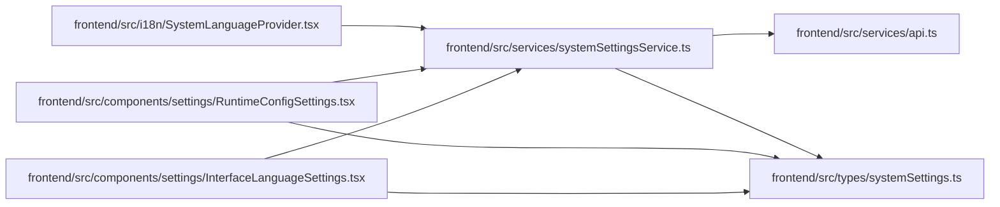

# systemSettingsService Module

**Path:** `frontend/src/services/systemSettingsService.ts`

## Description

_Auto-generated from `frontend/src/services/systemSettingsService.ts`._

## Imports

| Source | Symbols |
|--------|---------|
| `../types/systemSettings` | `AppRuntimeSettings`, `AppRuntimeSettingsUpdate`, `GitHubRuntimeSettings`, `GitHubRuntimeSettingsUpdate`, `LLMRuntimeSettings`, `LLMRuntimeSettingsUpdate`, `SystemSettings`, `WebIntakeRuntimeSettings`, `WebIntakeRuntimeSettingsUpdate` |
| `./api` | `api` |

## Module Signals

| Signal | Values |
|--------|--------|
| Exports | `systemSettingsService` |
| Constants | `systemSettingsService` |

## Local dependency map

<!-- Auto-generated local dependency summary. Do not edit by hand. -->

### Internal neighbors

| Direction | Module |
|---|---|
| Inbound | [InterfaceLanguageSettings](../modules/InterfaceLanguageSettings.md) |
| Inbound | [RuntimeConfigSettings](../modules/RuntimeConfigSettings.md) |
| Inbound | [SystemLanguageProvider](../modules/SystemLanguageProvider.md) |
| Outbound | [api](../modules/api.md) |
| Outbound | [systemSettings](../modules/systemSettings.md) |
