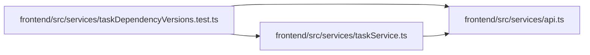

# taskDependencyVersions.test Module

**Path:** `frontend/src/services/taskDependencyVersions.test.ts`

## Description

_Auto-generated from `frontend/src/services/taskDependencyVersions.test.ts`._

## Imports

| Source | Symbols |
|--------|---------|
| `./api` | `api` |
| `./taskService` | `taskService` |
| `vitest` | `expect`, `it`, `vi` |

## Module Signals

| Signal | Values |
|--------|--------|
| Module calls | `mock`, `it` |

## Local dependency map

<!-- Auto-generated local dependency summary. Do not edit by hand. -->

### Internal neighbors

| Direction | Module |
|---|---|
| Outbound | [api](../modules/api.md) |
| Outbound | [taskService](../modules/taskService.md) |

### External packages

| Language | Used packages | Undeclared packages |
|---|---:|---:|
| typescript | 1 | 0 |
