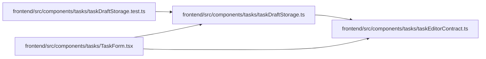

# taskDraftStorage Module

**Path:** `frontend/src/components/tasks/taskDraftStorage.ts`

## Description

_Auto-generated from `frontend/src/components/tasks/taskDraftStorage.ts`._

Parent discard removes the task draft and, when auxiliary cleanup is requested, progress, discussion, legacy time and all scoped time drafts under that parent key. Unrelated parent keys remain intact.

## Imports

| Source | Symbols |
|--------|---------|
| `./taskEditorContract` | `TaskEditorValues` |

## Module Signals

| Signal | Values |
|--------|--------|
| Exports | `readTaskDraft`, `removeTaskDraft`, `writeTaskDraft` |

## Local dependency map

<!-- Auto-generated local dependency summary. Do not edit by hand. -->

### Internal neighbors

| Direction | Module |
|---|---|
| Inbound | [taskDraftStorage.test](../modules/taskDraftStorage.test.md) |
| Inbound | [TaskForm](../modules/TaskForm.md) |
| Outbound | [taskEditorContract](../modules/taskEditorContract.md) |

## Functions

| Function | Signature | Decorators | Description |
|----------|-----------|------------|-------------|
| `readTaskDraft` | `(key: string \| null, defaults: TaskEditorValues) -> TaskEditorValues \| null` | — | — |
| `writeTaskDraft` | `(key: string \| null, values: TaskEditorValues)` | — | — |
| `removeTaskDraft` | `(key: string \| null, includeProgress = false)` | — | — |
