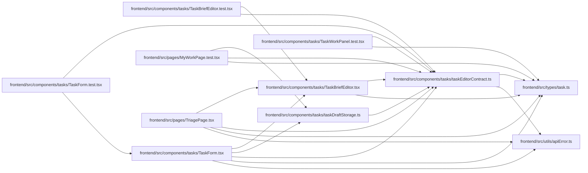

# taskEditorContract Module

**Path:** `frontend/src/components/tasks/taskEditorContract.ts`

## Description

_Auto-generated from `frontend/src/components/tasks/taskEditorContract.ts`._

## Imports

| Source | Symbols |
|--------|---------|
| `../../types/task` | `Task`, `TaskBrief`, `TaskCreate`, `TaskStatus`, `TaskUpdate` |
| `../../utils/apiError` | `getApiErrorMessage` |

## Module Signals

| Signal | Values |
|--------|--------|
| Exports | `TASK_EDITOR_FIELD_SCHEMA`, `TaskConflictMetadata`, `TaskEditorAvailability`, `TaskEditorSection`, `TaskEditorServerError`, `TaskEditorValidationCode`, `TaskEditorValidationIssue`, `TaskEditorValues`, `buildTaskEditorDefaults`, `emptyTaskBrief`, `mapTaskEditorServerError`, `newCriterion`, `toTaskCreate`, `toTaskUpdate`, `validateTaskEditor` |
| Constants | `TASK_EDITOR_FIELD_SCHEMA` |

## Local dependency map

<!-- Auto-generated local dependency summary. Do not edit by hand. -->

### Internal neighbors

| Direction | Module |
|---|---|
| Inbound | [TaskBriefEditor.test](../modules/TaskBriefEditor.test.md) |
| Inbound | [TaskBriefEditor](../modules/TaskBriefEditor.md) |
| Inbound | [taskDraftStorage](../modules/taskDraftStorage.md) |
| Inbound | [TaskForm.test](../modules/TaskForm.test.md) |
| Inbound | [TaskForm](../modules/TaskForm.md) |
| Inbound | [TaskWorkPanel.test](../modules/TaskWorkPanel.test.md) |
| Inbound | [MyWorkPage.test](../modules/MyWorkPage.test.md) |
| Inbound | [TriagePage](../modules/TriagePage.md) |
| Outbound | [types_task](../modules/types_task.md) |
| Outbound | [apiError](../modules/apiError.md) |

## Classes

| Class | Kind | Line | Bases / Target | Description |
|-------|------|------|----------------|-------------|
| [TaskEditorValues](../entities/TaskEditorValues.md) | Class | 10 | — | — |
| [TaskEditorDefaultsContext](../entities/TaskEditorDefaultsContext.md) | Class | 37 | — | — |
| [TaskEditorFieldDefinition](../entities/TaskEditorFieldDefinition.md) | Class | 45 | — | — |
| [TaskEditorValidationIssue](../entities/TaskEditorValidationIssue.md) | Class | 196 | — | — |
| [TaskConflictMetadata](../entities/TaskConflictMetadata.md) | Class | 265 | — | — |
| [TaskEditorSection](../entities/TaskEditorSection.md) | Type alias | 4 | — | — |
| [TaskEditorAvailability](../entities/TaskEditorAvailability.md) | Type alias | 5 | — | — |
| [TaskEditorValidationCode](../entities/TaskEditorValidationCode.md) | Type alias | 189 | — | — |
| [TaskEditorServerError](../entities/TaskEditorServerError.md) | Type alias | 273 | — | — |

## Functions

| Function | Signature | Decorators | Description |
|----------|-----------|------------|-------------|
| `emptyTaskBrief` | `() -> TaskBrief` | — | — |
| `buildTaskEditorDefaults` | `(context: TaskEditorDefaultsContext = {}) -> TaskEditorValues` | — | — |
| `validateTaskEditor` | `(values: TaskEditorValues, iterationAssigneeIds: ReadonlySet<number>) -> TaskEditorValidationIssue[]` | — | — |
| `toTaskCreate` | `(values: TaskEditorValues) -> TaskCreate` | — | — |
| `toTaskUpdate` | `(values: TaskEditorValues, options: { includeStatus?: boolean } = {}) -> TaskUpdate` | — | — |
| `mapTaskEditorServerError` | `(error: unknown, fallback: string) -> TaskEditorServerError` | — | — |
| `newCriterion` | `(text = '')` | — | — |
