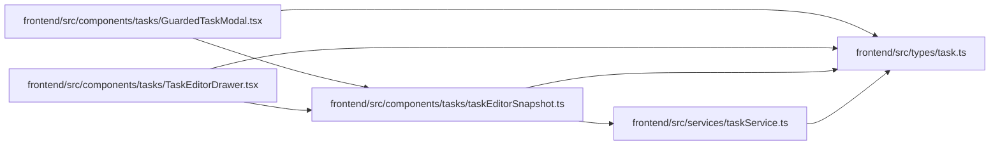

# taskEditorSnapshot Module

**Path:** `frontend/src/components/tasks/taskEditorSnapshot.ts`

## Description

_Auto-generated from `frontend/src/components/tasks/taskEditorSnapshot.ts`._

## Imports

| Source | Symbols |
|--------|---------|
| `../../services/taskService` | `taskService` |
| `../../types/task` | `Task` |

## Module Signals

| Signal | Values |
|--------|--------|
| Exports | `keepNewestTaskSnapshot`, `readTaskEditorSnapshot` |

## Local dependency map

<!-- Auto-generated local dependency summary. Do not edit by hand. -->

### Internal neighbors

| Direction | Module |
|---|---|
| Inbound | [GuardedTaskModal](../modules/GuardedTaskModal.md) |
| Inbound | [TaskEditorDrawer](../modules/TaskEditorDrawer.md) |
| Outbound | [taskService](../modules/taskService.md) |
| Outbound | [types_task](../modules/types_task.md) |

## Functions

| Function | Signature | Decorators | Description |
|----------|-----------|------------|-------------|
| `readTaskEditorSnapshot` | *(async)* `(taskId: number, signal: AbortSignal) -> Promise<Task>` | — | — |
| `keepNewestTaskSnapshot` | `(previous: unknown, next: unknown)` | — | — |
