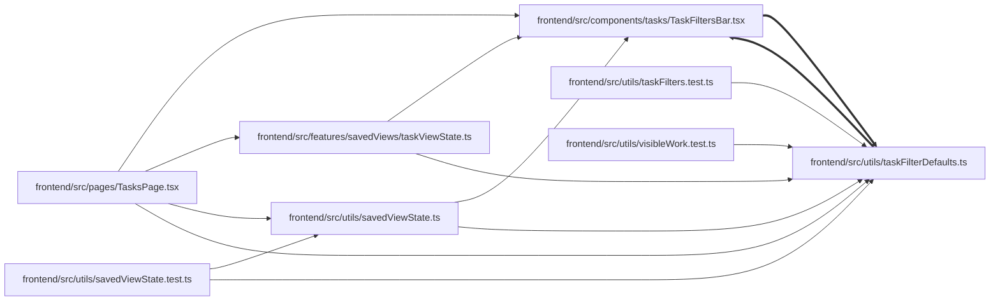

# taskFilterDefaults Module

**Path:** `frontend/src/utils/taskFilterDefaults.ts`

## Description

_Auto-generated from `frontend/src/utils/taskFilterDefaults.ts`._

## Imports

| Source | Symbols |
|--------|---------|
| `../components/tasks/TaskFiltersBar` | `TaskFilters` |

## Module Signals

| Signal | Values |
|--------|--------|
| Exports | `defaultFilters` |
| Constants | `defaultFilters` |

## Local dependency map

<!-- Auto-generated local dependency summary. Do not edit by hand. -->
<!-- Thick arrows (==>) mark edges inside an import cycle. -->

### Internal neighbors

| Direction | Module |
|---|---|
| Inbound | [TaskFiltersBar](../modules/TaskFiltersBar.md) |
| Inbound | [taskViewState](../modules/taskViewState.md) |
| Inbound | [TasksPage](../modules/TasksPage.md) |
| Inbound | [savedViewState.test](../modules/savedViewState.test.md) |
| Inbound | [savedViewState](../modules/savedViewState.md) |
| Inbound | [taskFilters.test](../modules/taskFilters.test.md) |
| Inbound | [visibleWork.test](../modules/visibleWork.test.md) |
| Outbound | [TaskFiltersBar](../modules/TaskFiltersBar.md) |
