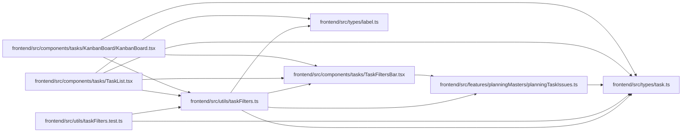

# taskFilters Module

**Path:** `frontend/src/utils/taskFilters.ts`

## Description

_Auto-generated from `frontend/src/utils/taskFilters.ts`._

## Imports

| Source | Symbols |
|--------|---------|
| `../components/tasks/TaskFiltersBar` | `TaskFilters` |
| `../features/planningMasters/planningTaskIssues` | `taskMatchesPlanningIssue` |
| `../types/label` | `LabelGroup` |
| `../types/task` | `Task` |

## Module Signals

| Signal | Values |
|--------|--------|
| Exports | `filterTaskWithChildren`, `taskMatchesFilters` |

## Local dependency map

<!-- Auto-generated local dependency summary. Do not edit by hand. -->

### Internal neighbors

| Direction | Module |
|---|---|
| Inbound | [KanbanBoard](../modules/KanbanBoard.md) |
| Inbound | [TaskList](../modules/TaskList.md) |
| Inbound | [taskFilters.test](../modules/taskFilters.test.md) |
| Outbound | [TaskFiltersBar](../modules/TaskFiltersBar.md) |
| Outbound | [planningTaskIssues](../modules/planningTaskIssues.md) |
| Outbound | [types_label](../modules/types_label.md) |
| Outbound | [types_task](../modules/types_task.md) |

## Functions

| Function | Signature | Decorators | Description |
|----------|-----------|------------|-------------|
| `taskMatchesFilters` | `(task: Task, filters: TaskFilters \| undefined, labelGroups: LabelGroup[] = []) -> boolean` | — | — |
| `filterTaskWithChildren` | `(task: Task, filters: TaskFilters \| undefined, labelGroups: LabelGroup[] = []) -> Task \| null` | — | — |
