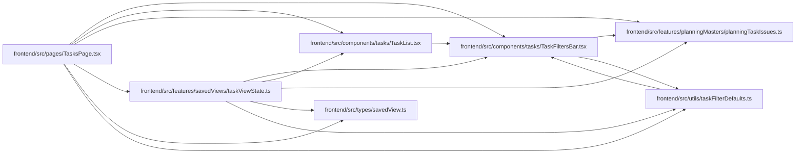

# taskViewState Module

**Path:** `frontend/src/features/savedViews/taskViewState.ts`

## Description

Saved task-view parsing is a pure shared boundary for accepted filter types, planning-issue keys and supported sorting choices. Page queries, scope changes and editor dismissal remain with the owning route.

_Auto-generated from `frontend/src/features/savedViews/taskViewState.ts`._

## Imports

| Source | Symbols |
|--------|---------|
| `../../components/tasks/TaskFiltersBar` | `TaskFilters` |
| `../../components/tasks/TaskList` | `SortKey` |
| `../../types/savedView` | `SavedView` |
| `../../utils/taskFilterDefaults` | `defaultFilters` |
| `../planningMasters/planningTaskIssues` | `parsePlanningTaskIssue` |

## Module Signals

| Signal | Values |
|--------|--------|
| Exports | `filtersFromSavedView`, `sortKeyFromSavedView` |
| Constants | `SORT_KEYS` |

## Local dependency map

<!-- Auto-generated local dependency summary. Do not edit by hand. -->

### Internal neighbors

| Direction | Module |
|---|---|
| Inbound | [TasksPage](../modules/TasksPage.md) |
| Outbound | [TaskFiltersBar](../modules/TaskFiltersBar.md) |
| Outbound | [TaskList](../modules/TaskList.md) |
| Outbound | [planningTaskIssues](../modules/planningTaskIssues.md) |
| Outbound | [savedView](../modules/savedView.md) |
| Outbound | [taskFilterDefaults](../modules/taskFilterDefaults.md) |

## Functions

| Function | Signature | Decorators | Description |
|----------|-----------|------------|-------------|
| `filtersFromSavedView` | `(view: SavedView) -> TaskFilters` | — | — |
| `sortKeyFromSavedView` | `(view: SavedView) -> SortKey \| null` | — | — |