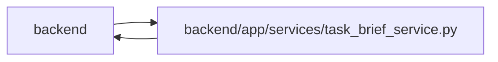

# task_brief_service Module

**Path:** `backend/app/services/task_brief_service.py`

## Description

Canonical brief rendering, conservative legacy conversion and evidence commands.

One structured brief owns goal, context, scope, exclusions, stable criteria, verification and artifact expectations. Markdown is derived. Conservative legacy conversion retains original prose and review notes; code examples and checkmarks do not establish acceptance. Progress is independently saved, and review requires current revisions and a distinct executor/evidence author. Work-package verification remains authoritative and context-bound.

Actual dependency changes invalidate current progress and acceptance through general updates and individual add/remove commands. Immutable evidence history remains available, a command reserves one task version, and no-op dependency requests retain their current version. Locked graph relationships are loaded explicitly before applying a dependency update.

## Imports

| Source | Symbols |
|--------|---------|
| `app.authority` | `AuthorityError`, `require_project` |
| `app.commands` | `atomic_command` |
| `app.models.task` | `Task` |
| `app.models.task_brief` | `TaskBriefRevision`, `TaskProgressRecord`, `TaskReviewRecord` |
| `app.schemas.task_brief` | `TaskBrief`, `ProgressWrite`, `TaskReviewWrite`, `BriefCriterion` |
| `re` | `re` |
| `sqlalchemy` | `func`, `select` |
| `uuid` | `NAMESPACE_URL`, `uuid5` |

## Local dependency map

<!-- Auto-generated local dependency summary. Do not edit by hand. -->

> Module-level dependencies exceed the generated-diagram limits, so the diagram and table below group them by top-level package. Counts report the number of module neighbors in each package.

### Internal neighbors

| Direction | Module |
|---|---|
| Inbound | `backend` (9) |
| Outbound | `backend` (5) |

### External packages

| Language | Used packages | Undeclared packages |
|---|---:|---:|
| python | 1 | 0 |

> All 14 module neighbor(s) are summarized by package because the module-level view exceeds the 12-node limit.

## Classes

| Class | Line | Bases | Description |
|-------|------|-------|-------------|
| [TaskBriefService](../entities/TaskBriefService.md) | 140 | — | — |

## Functions

| Function | Signature | Decorators | Description |
|----------|-----------|------------|-------------|
| `render_brief` | `(brief: TaskBrief \| dict) -> str` | — | Derive Markdown from canonical fields without projecting progress as acceptance. |
| `brief_definition_blockers` | `(brief: dict) -> list[str]` | — | Shared structured definition requirements for every agent projection. |
| `import_legacy_brief` | `(task_id: int, description: str \| None) -> tuple[TaskBrief, list[str]]` | — | Conservatively parse supported headings and preserve every unparsed line. |
| `clear_acceptance` | `(task: Task) -> None` | — | Invalidate the current projection while immutable verdict history remains. |
| `clear_execution_evidence` | `(task: Task) -> None` | — | A changed execution context needs fresh progress; history remains immutable. |
| `brief_from_draft` | `(draft, *, title = None, context = None) -> TaskBrief` | — | Project old draft/template fields into the canonical input contract. |