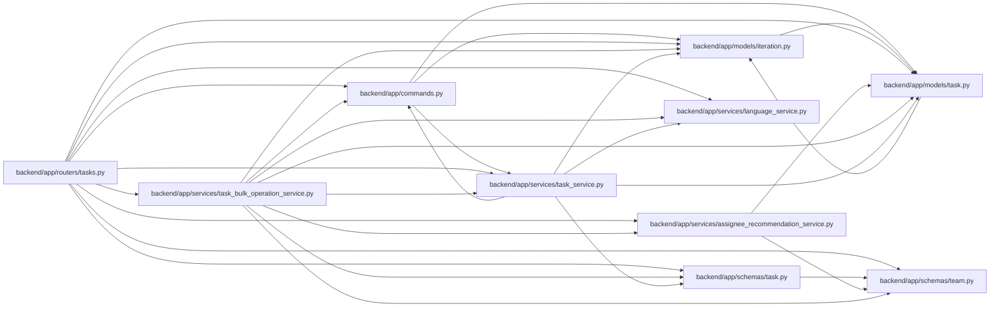

# task_bulk_operation_service Module

**Path:** `backend/app/services/task_bulk_operation_service.py`

## Description

Selected-task bulk operation orchestration.

Bulk preview returns original task and iteration revisions. Apply validates those observations before modifying selected work, and any failed item rejects the whole command. Preview defaults are preserved by the request transaction owner; supplied stale revisions cannot be retried as an unchanged plan.

## Imports

| Source | Symbols |
|--------|---------|
| `app.commands` | `atomic_command`, `lock_iterations` |
| `app.models.iteration` | `Iteration` |
| `app.models.task` | `Task`, `TaskStatus` |
| `app.schemas.task` | `TaskBulkOperationRequest`, `TaskBulkOperationResponse`, `TaskBulkOperationResult`, `TaskResponse`, `TaskUpdate` |
| `app.schemas.team` | `AssigneeRecommendationResponse` |
| `app.services.assignee_recommendation_service` | `AssigneeRecommendationService` |
| `app.services.language_service` | `backend_error_message`, `incomplete_dependency_message`, `invalid_status_transition_message`, `localized`, `resolve_runtime_ui_language`, `task_requires_schedule_message` |
| `app.services.task_service` | `TaskService` |
| `fastapi` | `HTTPException`, `status` |
| `json` | `json` |
| `sqlalchemy` | `select` |
| `sqlalchemy.ext.asyncio` | `AsyncSession` |
| `typing` | `Any`, `Optional` |

## Local dependency map

<!-- Auto-generated local dependency summary. Do not edit by hand. -->

### Internal neighbors

| Direction | Module |
|---|---|
| Inbound | [tasks](../modules/tasks.md) |
| Outbound | [commands](../modules/commands.md) |
| Outbound | [models_iteration](../modules/models_iteration.md) |
| Outbound | [models_task](../modules/models_task.md) |
| Outbound | [schemas_task](../modules/schemas_task.md) |
| Outbound | [schemas_team](../modules/schemas_team.md) |
| Outbound | [assignee_recommendation_service](../modules/assignee_recommendation_service.md) |
| Outbound | [language_service](../modules/language_service.md) |
| Outbound | [task_service](../modules/task_service.md) |

### External packages

| Language | Used packages | Undeclared packages |
|---|---:|---:|
| python | 2 | 0 |

## Classes

| Class | Line | Bases | Description |
|-------|------|-------|-------------|
| [TaskBulkOperationService](../entities/TaskBulkOperationService.md) | 33 | — | Validate, preview, and apply selected-task bulk operations. |