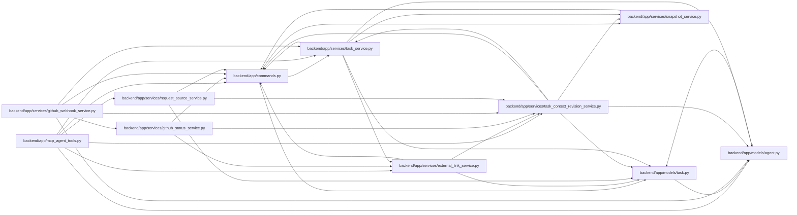

# task_context_revision_service Module

**Path:** `backend/app/services/task_context_revision_service.py`

## Description

Atomic task-version fencing for relationship-backed execution context.

Relationship-backed execution context uses the same iteration-before-task lock order, snapshot transaction and task version reservation as ordinary task commands. Context changes append evidence without owning an independent commit inside a transport command.

## Imports

| Source | Symbols |
|--------|---------|
| `app.commands` | `command_transaction` |
| `app.models.agent` | `TaskEvent` |
| `app.models.task` | `Task` |
| `app.services.snapshot_service` | `SnapshotService` |
| `app.services.task_service` | `TaskService`, `TaskService`, `TaskVersionConflictError` |
| `json` | `json` |
| `sqlalchemy` | `select` |
| `sqlalchemy.ext.asyncio` | `AsyncSession` |
| `typing` | `Any` |

## Local dependency map

<!-- Auto-generated local dependency summary. Do not edit by hand. -->

### Internal neighbors

| Direction | Module |
|---|---|
| Inbound | [mcp_agent_tools](../modules/mcp_agent_tools.md) |
| Inbound | [external_link_service](../modules/external_link_service.md) |
| Inbound | [github_status_service](../modules/github_status_service.md) |
| Inbound | [github_webhook_service](../modules/github_webhook_service.md) |
| Inbound | [request_source_service](../modules/request_source_service.md) |
| Outbound | [commands](../modules/commands.md) |
| Outbound | [models_agent](../modules/models_agent.md) |
| Outbound | [models_task](../modules/models_task.md) |
| Outbound | [snapshot_service](../modules/snapshot_service.md) |
| Outbound | [task_service](../modules/task_service.md) |

### External packages

| Language | Used packages | Undeclared packages |
|---|---:|---:|
| python | 1 | 0 |

## Classes

| Class | Line | Bases | Description |
|-------|------|-------|-------------|
| [TaskContextVersionConflictError](../entities/TaskContextVersionConflictError.md) | 14 | `RuntimeError` | Raised when another transaction reserves the task context version first. |

## Functions

| Function | Signature | Decorators | Description |
|----------|-----------|------------|-------------|
| `lock_task_context` | *(async)* `(db: AsyncSession, task_id: int) -> bool` | — | Lock the iteration before task context, including SQLite's writer reservation. |
| `reserve_task_context_revision` | *(async)* `(db: AsyncSession, task_id: int, *, context_kind: str, action: str, details: dict[str, Any] \| None = None) -> int \| None` | — | Reserve the shared task version and append context evidence under its command owner. |
