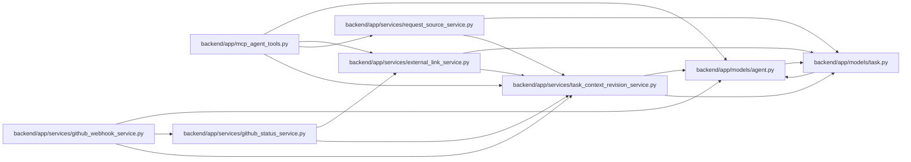

# task_context_revision_service Module

**Path:** `backend/app/services/task_context_revision_service.py`

## Description

Atomic task-version fencing for relationship-backed execution context.

## Imports

| Source | Symbols |
|--------|---------|
| `app.models.agent` | `TaskEvent` |
| `app.models.task` | `Task` |
| `json` | `json` |
| `sqlalchemy` | `select`, `text`, `update` |
| `sqlalchemy.ext.asyncio` | `AsyncSession` |
| `sqlalchemy.orm` | `attributes` |
| `typing` | `Any` |

## Local dependency map

<!-- Auto-generated local dependency summary. Do not edit by hand. -->

### Internal neighbors

| Direction | Module |
|---|---|
| Inbound | [mcp_agent_tools](../modules/mcp_agent_tools.md) |
| Inbound | [external_link_service](../modules/external_link_service.md) |
| Inbound | [github_status_service](../modules/github_status_service.md) |
| Inbound | [github_webhook_service](../modules/github_webhook_service.md) |
| Inbound | [request_source_service](../modules/request_source_service.md) |
| Outbound | [models_agent](../modules/models_agent.md) |
| Outbound | [models_task](../modules/models_task.md) |

### External packages

| Language | Used packages | Undeclared packages |
|---|---:|---:|
| python | 1 | 0 |

## Classes

| Class | Line | Bases | Description |
|-------|------|-------|-------------|
| [TaskContextVersionConflictError](../entities/TaskContextVersionConflictError.md) | 14 | `RuntimeError` | Raised when another transaction reserves the task context version first. |

## Functions

| Function | Signature | Decorators | Description |
|----------|-----------|------------|-------------|
| `lock_task_context` | *(async)* `(db: AsyncSession, task_id: int) -> bool` | — | Serialize one task-context mutation without changing its version. |
| `reserve_task_context_revision` | *(async)* `(db: AsyncSession, task_id: int, *, context_kind: str, action: str, details: dict[str, Any] \| None = None) -> int \| None` | — | Lock a task, increment its version, and append a server-owned audit event. |
