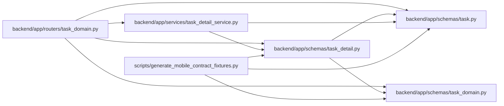

# task_detail Module

**Path:** `backend/app/schemas/task_detail.py`

## Description

Bounded UI projections with explicit completeness and deterministic cursors.

## Imports

| Source | Symbols |
|--------|---------|
| `app.schemas.task` | `TaskResponse` |
| `app.schemas.task_domain` | `TaskActionAvailability` |
| `datetime` | `datetime` |
| `pydantic` | `BaseModel`, `ConfigDict`, `Field` |

## Local dependency map

<!-- Auto-generated local dependency summary. Do not edit by hand. -->

### Internal neighbors

| Direction | Module |
|---|---|
| Inbound | [routers_task_domain](../modules/routers_task_domain.md) |
| Inbound | [task_detail_service](../modules/task_detail_service.md) |
| Inbound | [generate_mobile_contract_fixtures](../modules/generate_mobile_contract_fixtures.md) |
| Outbound | [schemas_task](../modules/schemas_task.md) |
| Outbound | [schemas_task_domain](../modules/schemas_task_domain.md) |

### External packages

| Language | Used packages | Undeclared packages |
|---|---:|---:|
| python | 1 | 0 |

## Classes

| Class | Line | Bases | Description |
|-------|------|-------|-------------|
| [TaskReference](../entities/task_detail_TaskReference.md) | 9 | `BaseModel` | — |
| [TaskReferencePage](../entities/task_detail_TaskReferencePage.md) | 26 | `BaseModel` | — |
| [TaskDetailResponse](../entities/TaskDetailResponse.md) | 34 | `BaseModel` | — |
| [HumanWorkReference](../entities/HumanWorkReference.md) | 43 | `TaskReference` | — |
| [HumanWorkResponse](../entities/HumanWorkResponse.md) | 47 | `BaseModel` | — |
