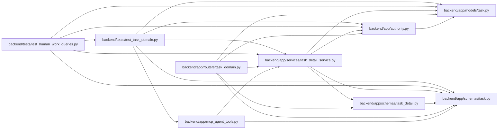

# task_detail_service Module

**Path:** `backend/app/services/task_detail_service.py`

## Description

Provides bounded task references, title/ID lookup and human ownership queues without loading the full execution graph. Human work can be filtered by authorized project, iteration or backlog before pagination. Queue categorization remains server-owned, including blocked prerequisites and acceptance reconciliation. Reference projections do not establish complete execution context.

## Imports

| Source | Symbols |
|--------|---------|
| `app.authority` | `require_project` |
| `app.models.task` | `Task`, `TaskDependency` |
| `app.schemas.task` | `TaskAgentReadiness` |
| `app.schemas.task_detail` | `TaskDetailResponse`, `TaskReference`, `TaskReferencePage` |
| `sqlalchemy` | `and_`, `or_`, `select` |
| `sqlalchemy.orm` | `selectinload`, `raiseload` |

## Local dependency map

<!-- Auto-generated local dependency summary. Do not edit by hand. -->

### Internal neighbors

| Direction | Module |
|---|---|
| Inbound | [mcp_agent_tools](../modules/mcp_agent_tools.md) |
| Inbound | [routers_task_domain](../modules/routers_task_domain.md) |
| Inbound | [test_human_work_queries](../modules/test_human_work_queries.md) |
| Inbound | [test_task_domain](../modules/test_task_domain.md) |
| Outbound | [authority](../modules/authority.md) |
| Outbound | [models_task](../modules/models_task.md) |
| Outbound | [schemas_task](../modules/schemas_task.md) |
| Outbound | [task_detail](../modules/task_detail.md) |

### External packages

| Language | Used packages | Undeclared packages |
|---|---:|---:|
| python | 1 | 0 |

## Classes

| Class | Line | Bases | Description |
|-------|------|-------|-------------|
| [TaskDetailService](../entities/TaskDetailService.md) | 12 | — | — |