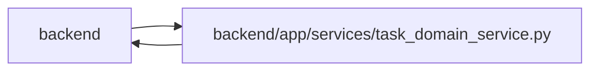

# task_domain_service Module

**Path:** `backend/app/services/task_domain_service.py`

## Description

Durable ownership, normalized effort and explicit task-domain commands.

Shared domain policy projects allowed actions and typed blockers across REST and MCP. Explicit human manual execution records actual events without manufacturing a schedule or estimate. Cancellation verifies current claim/run/assignment ownership before invalidating it; reopen clears current acceptance and progress. Commit/uncommit preserve task identity and durable ownership.

Calendar reassignment refreshes nominal workday and derived effort-day values under the existing planning transaction and version reservations. Canonical hours, unknown or zero estimates, estimate provenance and actual execution records are preserved.

Progress availability follows open-leaf execution permission and excludes direct agent evidence writes, which use their fenced work protocol. Current review projection support is advertised only with the adopted domain state; current verdicts and bounded history have distinct read surfaces.

## Imports

| Source | Symbols |
|--------|---------|
| `app.authority` | `AuthorityError`, `internal_authority`, `require_project` |
| `app.commands` | `atomic_command`, `lock_iterations` |
| `app.config` | `get_settings`, `get_settings` |
| `app.models.agent` | `AgentActor`, `AgentRun`, `AgentTaskAssignment` |
| `app.models.calendar` | `Calendar` |
| `app.models.identity` | `Principal`, `PrincipalProfileLink`, `ProjectMembership`, `WorkspaceMembership` |
| `app.models.iteration` | `Iteration` |
| `app.models.task` | `Task` |
| `app.models.team_member` | `TeamMemberProfile` |
| `app.schemas.task_domain` | `TaskActionsResponse`, `TaskActionRequest` |
| `app.services.task_brief_service` | `clear_acceptance` |
| `app.utils.time` | `utc_now` |
| `decimal` | `Decimal`, `ROUND_HALF_UP` |
| `sqlalchemy` | `or_`, `select` |

## Local dependency map

<!-- Auto-generated local dependency summary. Do not edit by hand. -->

> Module-level dependencies exceed the generated-diagram limits, so the diagram and table below group them by top-level package. Counts report the number of module neighbors in each package.

### Internal neighbors

| Direction | Module |
|---|---|
| Inbound | `backend` (7) |
| Outbound | `backend` (12) |

### External packages

| Language | Used packages | Undeclared packages |
|---|---:|---:|
| python | 1 | 0 |

> All 19 module neighbor(s) are summarized by package because the module-level view exceeds the 12-node limit.

## Classes

| Class | Line | Bases | Description |
|-------|------|-------|-------------|
| [TaskDomainService](../entities/TaskDomainService.md) | 155 | — | — |

## Functions

| Function | Signature | Decorators | Description |
|----------|-----------|------------|-------------|
| `normalize_effort` | `(values: dict, day_hours: float, *, current_hours = None) -> dict` | — | Hours are authoritative; round once to six decimals, preserving zero and unknown. |
| `nominal_day_hours` | *(async)* `(db, iteration_id) -> float` | — | — |
| `refresh_nominal_day_hours` | *(async)* `(db, iteration_ids, day_hours)` | — | Refresh display units under the caller's planning-input reservations. |
| `domain_capabilities` | *(async)* `(db)` | — | Advertise adoption only after the installed schema's backfill is complete. |
| `require_owner` | *(async)* `(db, profile_id, project_id)` | — | Validate human ownership independently of capacity IDs and agent assignment. |
| `action_projection` | `(task, authority, *, dependencies_complete = True, live_assignment = False)` | — | Transport-independent availability; execution commands recheck under row locks. |