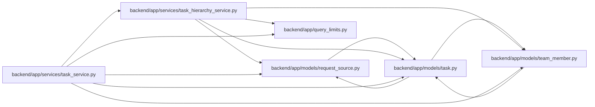

# task_hierarchy_service Module

**Path:** `backend/app/services/task_hierarchy_service.py`

## Description

The read-only collaborator owns bounded graph queries, dependency hydration, parent/cycle checks and deterministic tree assembly. Its caller supplies owner-name hydration and retains transaction, authorization and mutation ownership. TaskService preserves its facade and the legacy integrity-error import.

Read-only ownership of bounded task graph hydration and integrity checks.

## Imports

| Source | Symbols |
|--------|---------|
| `app.models.request_source` | `RequestSourceLink` |
| `app.models.task` | `Task`, `TaskDependency` |
| `app.models.team_member` | `TeamMember` |
| `app.query_limits` | `CollectionLimitExceededError`, `MAX_ITERATION_TREE_TASKS` |
| `sqlalchemy` | `select` |
| `sqlalchemy.orm` | `attributes`, `selectinload` |

## Local dependency map

<!-- Auto-generated local dependency summary. Do not edit by hand. -->

### Internal neighbors

| Direction | Module |
|---|---|
| Inbound | [task_service](../modules/task_service.md) |
| Outbound | [models_request_source](../modules/models_request_source.md) |
| Outbound | [models_task](../modules/models_task.md) |
| Outbound | [team_member](../modules/team_member.md) |
| Outbound | [query_limits](../modules/query_limits.md) |

### External packages

| Language | Used packages | Undeclared packages |
|---|---:|---:|
| python | 1 | 0 |

## Classes

| Class | Line | Bases | Description |
|-------|------|-------|-------------|
| [TaskTreeIntegrityError](../entities/TaskTreeIntegrityError.md) | 9 | `ValueError` | Raised when persisted task parent links cannot form a valid iteration tree. |
| [TaskHierarchyService](../entities/TaskHierarchyService.md) | 13 | — | — |